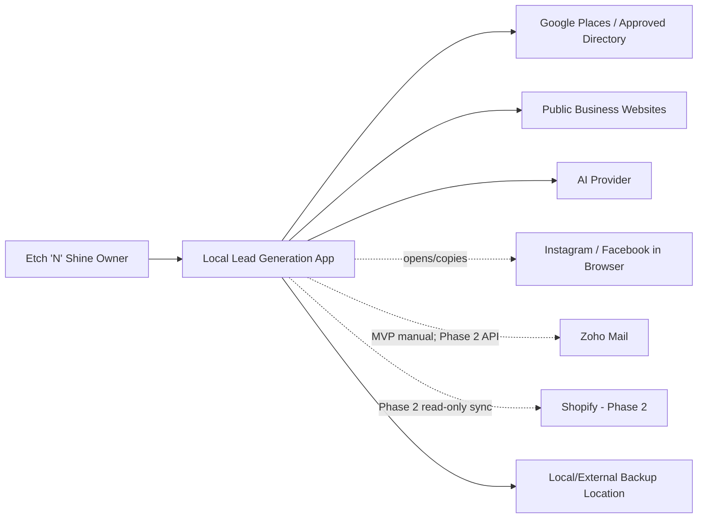
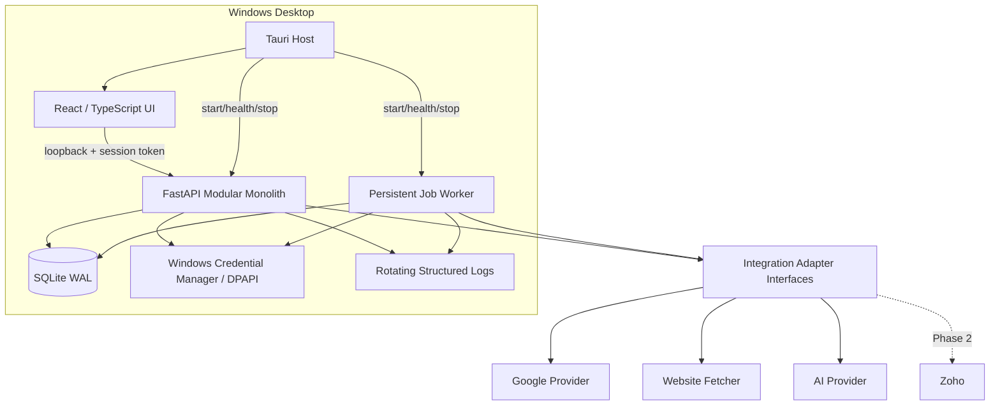
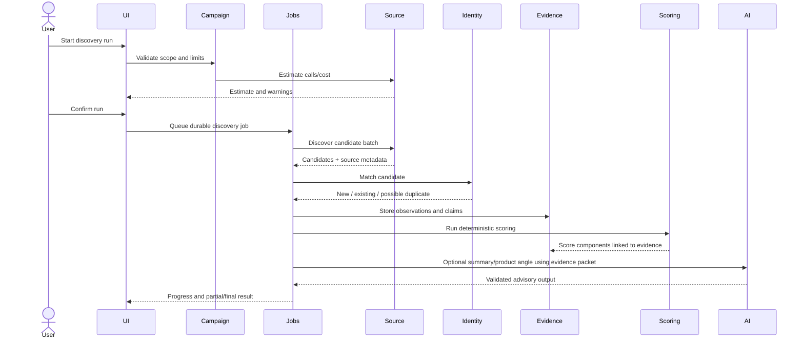
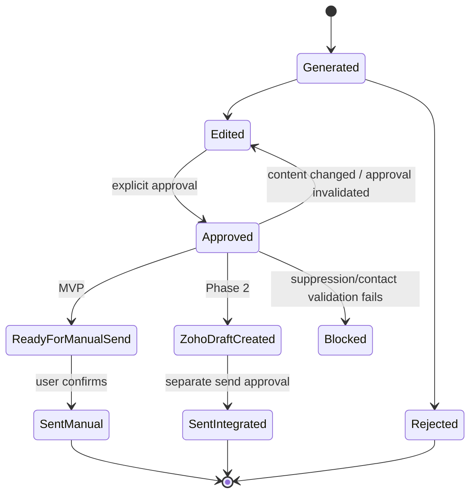
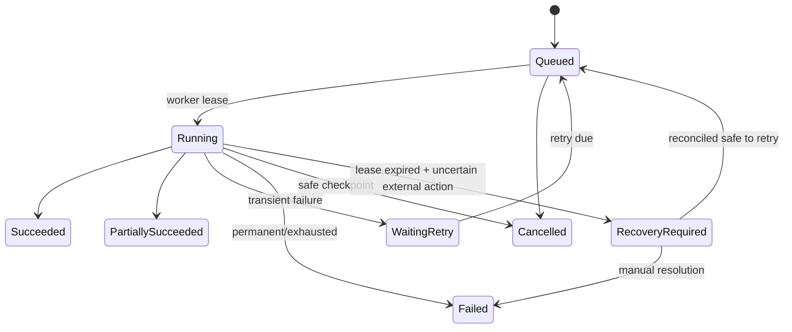

# Etch ’N’ Shine Lead Generation App
## Solution Architecture Assessment and Recommended Technical Design

**Assessment date:** 18 July 2026  
**Input:** BRD/FSD version 1.0  
**Decision status:** Recommended architecture for technical validation and implementation planning

---

# 1. Executive Architecture Verdict

## Verdict: Proceed, subject to controlled MVP scope amendments

The proposed application is technically feasible and commercially proportionate if it is implemented as a **local-first modular monolith** with a persistent SQLite database, a durable local job runner, explicit integration adapters, evidence-level provenance, deterministic lead scoring, and AI restricted to advisory tasks.

The BRD/FSD is unusually strong for an early-stage small-business application. It clearly prioritises lead quality, human approval, explainability, suppression controls, and phased integration. Its principal weakness is that it treats “lead discovery” as a unified capability when it is actually a portfolio of materially different acquisition methods with different licensing, access, cost, and reliability characteristics.

The recommended application is:

- a **desktop-wrapped local web application**, preferably Tauri;
- a React/TypeScript presentation layer;
- a Python FastAPI application service and background worker;
- SQLite in WAL mode with formal migrations and tested backup/restore;
- a persistent database-backed job queue rather than memory-only scheduling;
- source adapters for Google, CSV, manual capture, browser-assisted capture, and website enrichment;
- deterministic qualification and shortlist logic;
- a structured AI gateway supporting multiple providers;
- Windows Credential Manager or DPAPI-backed secret storage;
- no automated Instagram/Facebook sending or broad social scraping;
- manual Zoho sending in MVP, followed by Zoho draft creation before any direct-send integration.

## Core architectural decision

Do **not** build the MVP around automated social-platform discovery. Build it around:

1. Google Places or another approved business-directory source for the initial candidate set.
2. Manual and browser-assisted capture for Instagram and Facebook.
3. Controlled website enrichment for facts, public business contact routes, and product-fit evidence.
4. A reusable local lead database that stores canonical business information separately from provider-governed source data.

This distinction is essential because Google Places data has specific field, billing, attribution, caching, and storage constraints, while Meta’s official interfaces are not a general-purpose local-business prospecting index.

---

# 2. BRD/FSD Quality Scorecard

| Area | Score | Assessment |
|---|---:|---|
| Business purpose and objectives | 9/10 | Clear, outcome-focused, and proportionate. |
| Scope and phasing | 8/10 | Strong separation of MVP and later phases, but MVP discovery remains too broad. |
| Functional completeness | 9/10 | Covers the operational lifecycle from discovery through outcome. |
| Non-functional requirements | 7/10 | Good foundation; recovery, backup, supportability, and measurable security targets need strengthening. |
| Data requirements | 7/10 | Good entity list, but source observations, canonical values, AI runs, approvals, and job state need explicit separation. |
| Integration realism | 6/10 | Correctly calls for architectural assessment, but Google/Meta constraints must influence the core data design. |
| Security | 8/10 | Strong baseline; SSRF, local binding, OAuth callback handling, and backup encryption should be added. |
| Compliance controls | 8/10 | Strong suppression and provenance intent; contact classification and lawful-basis workflow require greater operational detail. |
| Testability | 7/10 | Acceptance criteria are useful but architecture-level failure and recovery criteria are missing. |
| Overall | **8.0/10** | Suitable to proceed after targeted amendments. |

---

# 3. Critical Findings

## F-01 — Lead discovery must be decomposed by source

**Severity:** Critical  
**Affected requirements:** FR-012 to FR-019, FR-030, FR-031, Section 33

The current specification allows discovery, enrichment, and durable storage to appear as one continuous process. They must be separated into:

- candidate discovery;
- provider observation storage;
- canonical lead creation;
- independent verification;
- website/social enrichment;
- user approval or rejection.

A source result should not automatically become the canonical truth for a lead.

### Recommendation

Introduce:

- `DiscoveryCandidate`;
- `SourceObservation`;
- `EvidenceClaim`;
- `CanonicalLead`;
- `EnrichmentSnapshot`;
- `FieldResolutionDecision`.

This allows provider-controlled or time-limited data to be refreshed or removed without destroying the business’s own relationship history.

## F-02 — Google Places cannot be treated as an unrestricted prospect database

**Severity:** Critical  
**Affected requirements:** FR-012, FR-030, FR-031, DR-001, DR-003

Google Places is suitable for candidate discovery and identifiers, but the design must respect field masks, billing tiers, display attribution, and restrictions on caching/storing Places content. The architecture should store the Google Place ID as the durable provider identifier, retain retrieval metadata, and minimise replicated provider data.

### Recommendation

Use a two-step pattern:

1. Nearby/Text Search using a minimal field mask to obtain candidate IDs, name, location, and relevant type.
2. Place Details only for shortlisted or user-reviewed candidates and only for required fields.

Never request wildcard fields in production. Estimate run cost before execution.

## F-03 — Automated Instagram/Facebook discovery should not be an MVP dependency

**Severity:** Critical  
**Affected requirements:** FR-013, FR-014, FR-030

The MVP should not depend on official Meta APIs yielding a comprehensive list of local bakeries, follower counts, recent-post details, or public profiles. Access can depend on app review, account relationships, permissions, product changes, and platform policy.

### Recommendation

For MVP:

- generate prepared Google/Bing/Instagram/Facebook search links;
- open the profile in the user’s default browser;
- offer a browser-assisted capture form;
- allow paste/import of profile URL, handle, follower estimate, last-post date, and user-observed evidence;
- record all manually observed values as `user_verified` or `user_observed`, not API verified;
- do not automate login, scrolling, messaging, or extraction from authenticated pages.

## F-04 — Deterministic scoring and AI reasoning are currently too closely coupled

**Severity:** High  
**Affected requirements:** FR-040 to FR-046, FR-151, FR-153

The numeric score should be computed entirely by deterministic, versioned rules. AI can extract candidate evidence and produce narrative explanations, but it should not directly assign the final score in the MVP.

### Recommendation

- Rule engine calculates each criterion from explicit evidence facts.
- Missing facts award no points and remain unknown.
- AI may propose fact classifications for review.
- Every score stores model version, rule set, input evidence IDs, calculation timestamp, and override history.

## F-05 — Background processing needs durable state, not scheduled callbacks

**Severity:** High  
**Affected requirements:** FR-016, FR-017, NFR-004, NFR-005, NFR-009

A local app may be closed or Windows may restart during a discovery or enrichment run. Memory-only schedulers will lose job state and can duplicate external calls.

### Recommendation

Use a database-backed job table and worker with explicit states:

`queued → running → waiting_retry → succeeded | partially_succeeded | failed | cancelled`

Every external step should use idempotency keys and checkpoints.

## F-06 — The pipeline has too many visible stages for the MVP

**Severity:** Medium  
**Affected requirements:** FR-090, FR-091

The defined states are useful as detailed internal statuses but excessive for the main Kanban view.

### Recommendation

Use six displayed groups:

1. New / Researching.
2. Qualified / Recommended.
3. Ready / Contacted / Follow-Up.
4. Replied / Mock-Up / Sample.
5. Quote / Negotiating.
6. Won / Lost / Not Suitable / DNC.

Preserve detailed status internally.

## F-07 — Local authentication should be optional but loopback binding is mandatory

**Severity:** High  
**Affected requirements:** SEC-001, NFR-001

For a single-user desktop-wrapped application, a second application password adds friction without much value if the process is bound to loopback, files have appropriate Windows ACLs, and the workstation account is protected. However, exposing the local API on `0.0.0.0` would create unnecessary risk.

### Recommendation

- Bind API to `127.0.0.1` only.
- Generate an ephemeral application session token shared between wrapper and API.
- Make app PIN/password optional for shared-device environments.
- Never expose the local service to the LAN by default.

## F-08 — Backup requirements lack recovery objectives

**Severity:** High  
**Affected requirements:** NFR-010, SEC-010

“Backup and restore” is not testable without recovery objectives.

### Recommendation

Add:

- RPO: maximum 24 hours for scheduled backup; zero for successful manual backup.
- RTO: restore within 30 minutes for a database up to the stated MVP capacity.
- Quarterly automated restore test or a restore-verification action inside the app.
- Encrypted backup option and integrity manifest.

---

# 4. Scope Amendments

## MVP — Retain

- Campaign management.
- Manual lead entry and CSV import.
- Google/provider-based candidate discovery using approved interfaces.
- Browser-assisted social capture.
- Controlled website enrichment.
- Deduplication and merge.
- Evidence/provenance.
- Deterministic bakery scoring.
- Product matching.
- Weekly shortlist.
- AI summary and draft generation.
- Manual email copy to Zoho.
- Manual Instagram DM workflow.
- Pipeline, follow-ups, notes, suppression, audit, analytics.
- Backup, restore, export.

## MVP — Simplify

- Support only one production scoring model: bakeries/home bakers.
- Keep other segments configurable but use generic rules until Phase 2.
- Scheduled discovery may be limited to one weekly schedule per active campaign.
- Analytics should focus on funnel counts, rates, source, channel, and segment; postpone advanced revenue attribution.
- Use one AI provider initially behind an internal adapter.
- Implement saved filters only after core search/filter performance is validated.

## Move to Phase 2

- Automated Facebook/Instagram data acquisition beyond approved, proven interfaces.
- Zoho draft creation and message reconciliation.
- Shopify catalogue synchronisation.
- Advanced fuzzy identity resolution.
- Quote and mock-up file management beyond status and link/reference fields.
- Multiple schedule expressions.
- Segment-specific scoring UI for all segments.

## Move to Phase 3

- Local AI models.
- Learning-based recommendations.
- Multi-user roles.
- Mobile companion.
- Geographic map visualisation.
- Revenue attribution beyond manually recorded won value.

## Remove unless separately justified

- Continuous social monitoring.
- Automated engagement calculation from social posts.
- Browser automation against authenticated social sessions.
- Generic website crawling across arbitrary depths.
- Direct autonomous send.

---

# 5. Feasibility Assessment

| Capability | Feasibility | Architectural position |
|---|---|---|
| Local Windows application | High | Use Tauri wrapper plus local API and SQLite. |
| 10,000 leads / 100,000 activities | High | SQLite is sufficient with indexes and WAL. |
| Manual and CSV lead capture | High | Straightforward; add import staging and formula-injection controls. |
| Google candidate discovery | High with constraints | Use Places API or approved provider; minimise fields and provider-data persistence. |
| Instagram discovery | Low-to-medium for automation | Use assisted workflow in MVP. |
| Facebook discovery | Low-to-medium for automation | Use assisted workflow in MVP. |
| Website enrichment | Medium-high | Limit to public pages, depth, domain, time, and content size. |
| Deterministic lead scoring | High | Strong fit for local modular monolith. |
| AI summaries and drafting | High | Use structured output, validation, caching, and approval. |
| Scheduled local jobs | High | Requires persistent jobs and a reliable launch mechanism. |
| Zoho manual workflow | High | MVP copy/open workflow is low risk. |
| Zoho draft/send API | High with integration effort | OAuth, scopes, token refresh, idempotency, reconciliation required. |
| Backup and restore | High | SQLite online backup or safe checkpoint/copy process. |
| Multi-user future | Medium | Preserve boundaries; migrate persistence and authentication later. |

---

# 6. Architecture Options

## Option A — Browser-based local web app

**Pattern:** User runs backend and opens `localhost` in a browser.

### Advantages

- Simplest development and debugging.
- Lowest packaging complexity.
- Easy reuse of web technology.
- Natural external-link workflows.

### Disadvantages

- User must understand server startup and shutdown.
- Browser tab lifecycle is separate from background-worker lifecycle.
- Secrets and local process coordination require additional care.
- Less polished installation/update experience.

## Option B — Tauri desktop wrapper with local application service

**Pattern:** Tauri provides desktop shell and lifecycle; React UI communicates with a loopback API or embedded command layer; Python backend/worker runs as a managed sidecar.

### Advantages

- Professional single-app experience.
- Lower memory footprint than Electron.
- Good Windows packaging and native integrations.
- Can manage backend process, health, updates, external browser links, and file dialogs.
- Preserves web-development productivity.

### Disadvantages

- Sidecar packaging and upgrades require disciplined build automation.
- Cross-process communication and version compatibility must be tested.
- More complex than a plain localhost app.

## Option C — Electron desktop wrapper

### Advantages

- Mature ecosystem.
- Straightforward web app packaging.
- Strong process and auto-update support.

### Disadvantages

- Higher memory and package footprint.
- Bundled Chromium is excessive for this focused application.
- Security hardening is required to avoid unsafe renderer privileges.

## Option D — Native .NET desktop application

### Advantages

- Excellent Windows integration.
- Strong credential and installer support.
- Single primary language possible with ASP.NET Core/WinUI or WPF.

### Disadvantages

- Slower UI iteration if the implementation team is web/Python focused.
- Less portable.
- AI, scraping, and data-processing libraries may be easier to implement in Python.

## Selected option

**Option B: Tauri desktop wrapper + React/TypeScript UI + Python FastAPI modular monolith and worker.**

A plain local web app remains a credible fallback if packaging becomes the principal delivery risk. Electron is not justified unless the team already has a strong Electron delivery pipeline. Native .NET is credible if the selected developer is substantially stronger in .NET than Python.

---

# 7. Recommended Target Architecture

## 7.1 Architectural style

Use a **modular monolith** with ports-and-adapters boundaries:

- one deployed application;
- one primary database;
- one background worker process;
- no independently deployed microservices;
- integration adapters isolated behind interfaces;
- domain services independent of HTTP, UI, and providers.

## 7.2 Recommended stack

| Layer | Recommendation | Rationale |
|---|---|---|
| Desktop shell | Tauri 2.x | Small footprint, native packaging, process/file/browser integration. |
| Frontend | React + TypeScript + Vite | Mature component model, typed contracts, rapid UX iteration. |
| UI state/data | TanStack Query; lightweight local state | Server state and retries without an oversized state framework. |
| API/application | Python 3.13 + FastAPI + Pydantic | Strong validation, AI/data ecosystem, clear OpenAPI contracts. |
| ORM/data access | SQLAlchemy 2 + Alembic | Mature transactions and migrations. |
| Database | SQLite WAL + FTS5 | Appropriate for single-user scale and local deployment. |
| Background jobs | DB-backed custom queue or APScheduler plus persisted job/execution tables | Durable scheduling and recovery without Redis. |
| HTTP client | httpx | Timeouts, async support, connection pooling. |
| HTML extraction | selectolax/BeautifulSoup plus structured-data parser | Controlled server-side extraction. |
| Browser assistance | System browser deep links; optional browser extension later | Avoid authenticated browser automation in MVP. |
| AI gateway | Provider adapters with JSON Schema/Pydantic validation | Model portability and safe structured outputs. |
| Secrets | Windows Credential Manager or DPAPI-backed vault | Keep credentials outside DB/config files. |
| Logging | Python structured JSON logs with rotation | Diagnostics and supportability. |
| Packaging | Tauri bundle/MSI plus signed release where possible | Single-user install and upgrade. |

## 7.3 Runtime processes

1. **Tauri host** starts and monitors the backend.
2. **FastAPI application process** serves loopback-only API endpoints.
3. **Worker process** polls durable jobs and runs external operations.
4. **SQLite database** stores business data, job state, audit events, and configuration metadata.
5. **Secret vault** stores API keys and OAuth refresh tokens.

For the smallest initial implementation, the API and worker may be hosted in one Python process with separate async tasks, provided job state remains durable and a crashed job can be recovered. Separate processes are preferable before scheduled unattended runs are enabled.

---

# 8. Component and Module Design

| Module | Owns | Must not own |
|---|---|---|
| Campaigns | Campaign definitions, targeting, limits, schedules | Provider-specific request logic |
| Discovery | Discovery runs, candidate intake, source adapter coordination | Canonical lead mutation without identity resolution |
| Identity | Normalisation, matching, merge decisions, canonical business identity | External API calls |
| Evidence | Claims, source observations, verification status, snapshots | Final business workflow decisions |
| Enrichment | Orchestrates website/provider enrichment | Direct UI concerns |
| Scoring | Rule sets, versions, score runs, overrides | AI-authored final numeric score |
| Products | Product catalogue and deterministic segment mappings | Shopify-specific implementation |
| Recommendations | Weekly shortlist, capacity, freshness, exclusion rules | Outreach sending |
| AI | Prompt tasks, provider adapters, structured output, usage | Canonical truth or approval |
| Outreach | Drafts, templates, versions, approvals, outbox actions | Provider OAuth internals |
| Communications | Sent confirmations, external IDs, reply logs, timeline | Draft generation rules |
| Pipeline | Stages, opportunity values, outcome reasons | Discovery implementation |
| Follow-ups | Next actions, due/overdue completion | Background provider calls |
| Compliance | Contact classification, lawful-basis note, suppression, objection | Legal conclusions |
| Analytics | Read models and aggregated measures | Source-of-truth writes |
| Jobs | Queue, leases, retries, checkpoints, schedule triggers | Business-specific provider parsing |
| Integrations | Google, website, AI, Zoho, Shopify adapters | Cross-domain workflow orchestration |
| Configuration | Non-secret settings and feature flags | Plaintext secrets |
| Audit | Append-only security and business-sensitive events | General debug logging |

All external provider access must flow through adapter interfaces. Domain modules should not import vendor SDKs directly.

---

# 9. Data Architecture

## 9.1 SQLite decision

SQLite is appropriate because:

- the MVP is single-user;
- expected writes are moderate;
- 10,000 leads and 100,000 activities are small for SQLite;
- local deployment and backup are simpler than running PostgreSQL;
- full ACID transactions are available;
- WAL mode improves read/write concurrency.

### Required SQLite controls

- Enable WAL mode.
- Set a sensible busy timeout.
- Keep transactions short.
- Use foreign keys.
- Create explicit indexes for normalised identity fields, campaign/stage/status, due dates, evidence lead/source, and job state/run time.
- Use FTS5 for name, description, notes, and possibly website text summaries.
- Use Alembic migrations; never mutate schemas ad hoc.
- Run `PRAGMA integrity_check` during backup verification and support diagnostics.
- Perform checkpoint-aware backup using SQLite backup API rather than copying an active database blindly.

## 9.2 Logical model amendments

### Canonical business entities

- `lead`
- `business_identity`
- `business_location`
- `contact_point`
- `lead_campaign`
- `lead_stage_event`
- `lead_note`

### Acquisition and evidence

- `discovery_run`
- `discovery_candidate`
- `source_system`
- `source_observation`
- `evidence_claim`
- `enrichment_snapshot`
- `field_resolution`

### Scoring and recommendation

- `scoring_model`
- `scoring_model_version`
- `score_execution`
- `score_component`
- `score_override`
- `product`
- `product_match_rule`
- `product_recommendation`
- `weekly_shortlist`
- `weekly_shortlist_item`

### AI

- `ai_provider_configuration` — no secret value stored here
- `ai_task_execution`
- `prompt_template`
- `prompt_template_version`
- `ai_input_evidence`
- `ai_output`

### Outreach and approvals

- `outreach_template`
- `outreach_draft`
- `outreach_draft_version`
- `approval_decision`
- `outbox_action`
- `communication`
- `communication_response`

### Compliance

- `contact_classification`
- `processing_basis_record`
- `suppression_record`
- `retention_review`
- `deletion_event`

### Operations

- `job_definition`
- `job_execution`
- `job_checkpoint`
- `integration_account`
- `api_usage_event`
- `audit_event`
- `backup_manifest`

## 9.3 Canonical versus observed data

Do not overwrite a canonical lead field every time an adapter returns a value.

Example:

- Google returns a formatted address.
- Website structured data returns another address.
- User confirms a trading address.

Store all three as observations. Select one canonical value through deterministic precedence or explicit user confirmation. Preserve the source claim history.

## 9.4 Identity resolution

Use a weighted deterministic matcher:

- exact website registrable domain: very high confidence;
- exact normalised email or telephone: very high confidence;
- exact social handle: high confidence;
- provider ID from same provider: definitive within provider;
- name + postcode: high confidence;
- fuzzy name + geographic proximity: possible match only;
- same address with materially different name: review required.

Never auto-merge on fuzzy name alone.

---

# 10. Discovery and Enrichment Design

## 10.1 Source-adapter contract

Each adapter should implement:

```text
validate_configuration()
estimate(request) -> count/cost/warnings
discover(request, cursor) -> CandidateBatch
fetch_details(external_id) -> SourceObservationBatch
health_check() -> IntegrationHealth
```

Each `DiscoveryCandidate` should contain:

- source system;
- external identifier;
- source URL;
- observed display name;
- observed location;
- observed category/type;
- retrieval timestamp;
- raw-response hash;
- provider terms/caching classification;
- confidence;
- adapter version.

## 10.2 Google strategy

### MVP

- Use Places API (New) Nearby Search and Text Search.
- Split the 25-mile search into controlled geographic cells if coverage tests show a single query does not produce adequate breadth.
- Use a minimal field mask on search.
- Store Place ID indefinitely where permitted.
- Request detail fields only after candidate filtering.
- Display required Google attribution when Google-derived content is shown.
- Store user-entered or independently verified facts as canonical business data, not as a disguised permanent mirror of Google content.

### Cost guardrails

- campaign-level max requests;
- per-run estimated cost shown before execution;
- no wildcard field mask;
- detail calls limited to top candidates or explicit user selection;
- cache adapter request hashes only within policy constraints;
- track API usage by SKU-equivalent operation and campaign.

## 10.3 Instagram and Facebook strategy

### MVP

- assisted search links;
- manual profile URL capture;
- copy-and-paste details;
- user-observed posting frequency and follower range;
- optional screenshot/file reference kept outside automated analysis unless explicitly processed;
- open profile in external browser;
- copy DM and require manual sent confirmation.

### Later

Only implement official API access after a technical spike confirms:

- eligible account types;
- approved permissions;
- access to required targets;
- terms allowing the intended processing;
- stable commercial value.

## 10.4 Website enrichment

Use a conservative same-domain crawler:

- start with homepage;
- optionally visit a maximum of five likely pages: contact, about, services/products, weddings/events, gallery/menu;
- maximum depth 1 or 2;
- same registrable domain only;
- no authentication;
- no form submission;
- obey explicit robots restrictions and site terms assessment;
- identify the application in User-Agent;
- rate limit per domain;
- cap response size and total pages;
- block private, loopback, link-local, and metadata IP ranges to prevent SSRF;
- validate redirects at every hop;
- parse JSON-LD and common metadata before free-text extraction;
- store extracted claims with page URL, content hash, and collection time;
- do not retain complete page HTML unless necessary and justified.

## 10.5 Partial-result handling

A discovery run may complete as `partially_succeeded`. Existing candidate results must remain usable even when one source fails. Each source step records its own status and errors.

---

# 11. AI Architecture

## 11.1 AI responsibilities

AI may:

- classify a business from supplied evidence;
- summarise verified observations;
- suggest product fit;
- suggest an outreach angle;
- draft email and DM content;
- turn deterministic score components into readable prose;
- summarise lead notes.

AI must not:

- invent evidence;
- determine the canonical business identity;
- bypass duplicate/suppression checks;
- set the approved score directly;
- approve or send communication;
- promise price, capacity, discount, sample, or lead time;
- infer a named person without evidence.

## 11.2 AI execution pattern

1. Build a compact evidence packet containing claim IDs, values, classifications, dates, and source types.
2. Apply task-specific data minimisation.
3. Send a versioned system/task prompt.
4. Require structured JSON output.
5. Validate with Pydantic/JSON Schema.
6. Reject unknown evidence IDs and unsupported claims.
7. Store provider, model, prompt version, input hash, token usage, latency, status, and output.
8. Render the result as advisory content requiring review.

## 11.3 Caching

Cache by:

`task_type + prompt_version + model_profile + canonical_input_hash`

Do not rerun analysis if evidence and prompt/model profile are unchanged unless the user explicitly regenerates.

## 11.4 Provider abstraction

Define an internal interface for:

- structured completion;
- timeout/cancellation;
- usage extraction;
- provider error classification;
- optional model capability metadata.

Start with one provider but implement no provider-specific types outside the adapter.

## 11.5 Evaluation

Create a bakery-focused golden dataset of at least 30–50 representative prospects:

- clear fit;
- weak fit;
- inactive business;
- duplicate;
- missing data;
- ambiguous sole trader;
- wedding-focused bakery;
- high followers but low product relevance;
- strong local repeat-order potential.

Measure factuality, evidence citation, product-fit usefulness, tone, prohibited claims, and user edit distance.

---

# 12. Scheduling and Background Jobs

## 12.1 Persistent job design

`job_execution` fields:

- job ID and type;
- campaign/lead reference;
- idempotency key;
- state;
- priority;
- scheduled time;
- attempts and max attempts;
- lease owner and expiry;
- current step;
- progress numerator/denominator;
- checkpoint data;
- error class and redacted message;
- created/started/completed timestamps;
- cancellation requested flag.

## 12.2 Recovery

On startup:

- detect `running` jobs with expired leases;
- return safe/idempotent jobs to `queued` or `waiting_retry`;
- mark unsafe non-idempotent operations for manual reconciliation;
- never assume an external email failed merely because the local process lost the response.

## 12.3 Retry policy

- Retry transient network failures, 429s, and selected 5xx responses.
- Honour `Retry-After`.
- Use exponential backoff with jitter.
- Do not retry validation, authentication, policy, or unsupported-operation failures without intervention.
- Apply per-provider concurrency and daily/request budgets.

## 12.4 Windows scheduling

Recommended pattern:

- the Tauri app manages schedules while open;
- optional Windows Task Scheduler entry launches a lightweight `run-due-jobs` command at login and at a controlled interval;
- job due dates remain in SQLite, making Task Scheduler a wake-up mechanism rather than the source of scheduling truth.

This is more robust than keeping the full app permanently open while avoiding a Windows Service in the MVP.

---

# 13. Security Architecture and Threat Model

## 13.1 Priority threats

| Threat | Risk | Primary mitigation |
|---|---|---|
| Malicious website causes SSRF | High | URL/IP validation, redirect revalidation, blocked network ranges, no browser credentials. |
| API/OAuth secret disclosure | High | Windows vault/DPAPI, no frontend storage, log redaction. |
| Local API exposed to LAN | High | Bind to loopback; ephemeral session token. |
| Stored HTML/script causes XSS | High | Never render raw HTML; sanitise and escape all external content. |
| CSV formula injection | Medium | Prefix/export sanitisation for cells beginning `=`, `+`, `-`, `@`. |
| Duplicate or suppressed outreach | High | Transactional approval guard and send-time revalidation. |
| AI-generated unsupported statement | High | Evidence IDs, structured validation, human approval. |
| OAuth callback interception | Medium | PKCE, state/nonce, loopback callback, short-lived authorisation transaction. |
| Backup disclosure | Medium-high | ACLs, optional encryption, clear backup location warnings. |
| Dependency compromise | Medium | Lockfiles, vulnerability scanning, signed/reproducible builds where practical. |

## 13.2 Secrets

Store API keys and OAuth refresh tokens in Windows Credential Manager or a DPAPI-protected local vault. The database stores only a secret reference and non-sensitive integration metadata.

## 13.3 Approval invariant

At the point of external send, the system must transactionally verify:

- draft version is approved;
- approval refers to the same content hash;
- lead is not suppressed;
- contact route has not changed;
- there is no conflicting in-flight send;
- weekly/campaign controls allow the action.

Editing an approved draft invalidates approval.

## 13.4 Audit

Audit events should be append-only at application level and include:

- actor;
- action;
- entity;
- before/after summary or hashes;
- timestamp;
- correlation ID;
- reason where required.

Audit logs are not a replacement for security logs and should not contain OAuth tokens, API keys, or unnecessary full message bodies.

---

# 14. Compliance-Control Design

This section identifies product controls and is not legal advice.

## 14.1 Contact classification

Every lead/contact route must be classified as:

- corporate subscriber;
- sole trader/individual subscriber;
- partnership requiring individual treatment;
- unknown.

Unknown classification should trigger a warning and block unattended external send. Because home bakers are commonly sole traders, this is a material workflow control rather than an edge case.

## 14.2 Required outreach controls

- clear sender/business identity;
- valid opt-out address or method;
- record of source and collection date;
- lawful-basis/assessment note where personal data is used;
- do-not-contact and objection processing;
- immediate suppression checks before approval and send;
- no contact after objection except where legally necessary;
- retention-review date;
- privacy information link or approved wording;
- channel-specific contact history.

## 14.3 Suppression retention

Deleting a lead should remove unnecessary personal and prospect data while preserving a minimal, access-controlled suppression fingerprint where justified to prevent re-contact. The design should support hashed or normalised identifiers and a reason/date without retaining the full historical lead profile.

## 14.4 Legal review gates

Professional UK legal/privacy review is recommended before:

- production email or social-DM outreach to sole traders/home bakers;
- relying on legitimate interests at scale;
- introducing automated send;
- retaining substantial social-profile data;
- defining retention periods;
- deciding privacy notice and opt-out wording.

---

# 15. Integration Recommendations

## 15.1 Google Places

**MVP:** Candidate discovery with minimal search fields; details only for selected candidates.  
**Stored durable identifier:** Place ID.  
**Fallback:** Assisted Google search links and manual capture.  
**Controls:** Field masks, attribution, policy-aware storage, cost estimate, quotas, request log.

## 15.2 Instagram

**MVP:** Assisted search/profile capture and manual DM.  
**Stored identifier:** Normalised handle and public profile URL, with source/date.  
**Fallback:** Manual entry.  
**Controls:** No login automation, no scraping of authenticated content, no automated DM.

## 15.3 Facebook

Same pattern as Instagram for MVP.

## 15.4 Business websites

**MVP:** Controlled, same-domain enrichment.  
**Stored identifier:** Registrable domain and source URLs.  
**Fallback:** Open site and manual capture.  
**Controls:** robots/terms assessment, rate limit, SSRF protection, content caps, provenance.

## 15.5 AI provider

**MVP:** One configured provider behind adapter.  
**Stored identifier:** Provider/model/prompt version and request metadata.  
**Fallback:** Manual summary/scoring/drafting.  
**Controls:** Schema validation, data minimisation, budgets, cache, failure isolation.

## 15.6 Zoho Mail

**MVP:** Copy subject/body and open Zoho Mail manually.  
**Phase 2A:** Create a Zoho draft only.  
**Phase 2B:** Send approved mail after a separate production-readiness review.  
**Stored identifier:** Account ID, draft/message ID, content hash, status, timestamps.  
**Controls:** OAuth least privilege, token vault, idempotency, approval invariant, uncertain-send reconciliation.

## 15.7 Shopify

**Phase 2:** Read-only product catalogue synchronisation.  
**Fallback:** Editable local product catalogue.  
**Controls:** Keep local product IDs and map external Shopify IDs; do not make Shopify availability or price an automatic promise in outreach.

---

# 16. Architecture Diagrams

## 16.1 System context



## 16.2 Container/component architecture



## 16.3 Discovery and enrichment flow



## 16.4 Outreach approval and send flow



## 16.5 Job lifecycle



---

# 17. Non-Functional Requirement Revisions

Add or amend the following:

## NFR-A01 — Recovery point objective

Scheduled backups must limit loss of successfully committed business data to no more than 24 hours. A completed manual backup has an RPO of zero relative to its completion timestamp.

## NFR-A02 — Recovery time objective

A valid backup containing the stated MVP capacity must be restorable and verified within 30 minutes on a supported Windows device.

## NFR-A03 — Job recovery

After abnormal termination, queued jobs and idempotent interrupted jobs must be recoverable without data corruption. The system must identify stale running jobs within five minutes of worker startup.

## NFR-A04 — External requests

Every external request must define connection, read, and total timeouts. Retries must be bounded and observable.

## NFR-A05 — Local exposure

The application API must bind to loopback by default and must not accept LAN connections unless a future explicitly secured mode is introduced.

## NFR-A06 — Audit retention

Security- and compliance-relevant audit events must be retained for a configurable period, initially 24 months, subject to legal review.

## NFR-A07 — Backup verification

Every backup must include a manifest, database integrity result, schema version, created time, and application version. The application must support a non-destructive restore verification.

## NFR-A08 — AI validation

Invalid or schema-nonconforming AI output must not update canonical lead, scoring, approval, or communication state.

## NFR-A09 — Accessibility

Target WCAG 2.2 AA for applicable desktop-web UI controls, including keyboard operation, visible focus, labels, contrast, and error identification.

## NFR-A10 — Platform support

Define and test supported editions of 64-bit Windows 11 and any intended Windows 10 support before release.

## NFR-A11 — Logs

Logs must rotate by size/time, redact secrets and sensitive payloads, and have a configurable retention period.

## Revised performance targets

- Dashboard under 3 seconds at P95 on the supported baseline workstation with no external refresh.
- Lead search under 1 second at P95 for 10,000 leads using indexed filters.
- Lead detail under 2 seconds at P95 excluding external operations.
- 1,000-row CSV import validates and stages within 30 seconds on baseline hardware.
- UI remains responsive while external jobs execute.

---

# 18. Testing Strategy

## Unit and domain tests

- score calculations and missing-evidence behaviour;
- shortlist exclusions and capacity;
- suppression and approval invariants;
- pipeline transitions;
- identity normalisation and confidence;
- retention/deletion rules;
- cost estimates and quota checks.

## Database tests

- every migration from an empty database and previous supported version;
- rollback/recovery strategy where applicable;
- foreign keys and uniqueness;
- concurrent API/worker transactions;
- WAL checkpoint and backup;
- restore and integrity checks.

## Adapter contract tests

- recorded provider fixtures;
- authentication failures;
- rate limits;
- malformed responses;
- partial batches;
- policy/caching metadata;
- idempotent retries.

## Security tests

- SSRF payloads and redirect chains;
- malicious HTML/XSS;
- CSV formula injection;
- path traversal and unsafe filenames;
- local API network binding;
- secret redaction;
- OAuth state and PKCE;
- dependency scan.

## AI tests

- golden prospect dataset;
- unsupported-claim rejection;
- evidence ID validity;
- prompt regression;
- schema failures;
- provider timeout/fallback;
- content changed after approval.

## End-to-end tests

1. Create Luton bakery campaign.
2. Estimate and run discovery.
3. Create/merge candidates.
4. Enrich selected lead.
5. Score and shortlist.
6. Generate/edit/approve outreach.
7. Copy/send manually and confirm.
8. Create follow-up.
9. Record reply and mock-up/quote outcome.
10. Export, backup, restore, and verify.

---

# 19. Delivery Roadmap

## Stage 0 — Architecture spikes

- Validate Tauri sidecar packaging and process management.
- Validate SQLite backup/restore and WAL behaviour.
- Prove Google discovery field/cost model using a restricted test project.
- Prove website fetcher safety controls.
- Prove one AI structured-output task.
- Validate Windows credential storage.

**Exit:** All high-risk technical assumptions demonstrated in thin prototypes.

## Stage 1 — Local operating core

- Shell, local API, database, migrations.
- Campaigns.
- Manual lead entry.
- CSV staging/import.
- lead list/detail.
- pipeline, notes, follow-ups.
- suppression and audit.
- backup/restore.

**Outcome:** Useful local lightweight CRM without external discovery.

## Stage 2 — Evidence and qualification

- evidence/observation model;
- identity resolution;
- deterministic bakery score;
- product catalogue and matching;
- weekly shortlist.

**Outcome:** User can rank manually entered/imported prospects.

## Stage 3 — Controlled discovery

- Google adapter;
- run estimation/limits;
- persistent job worker;
- assisted social capture;
- website enrichment.

**Outcome:** Usable pilot prospect database can be built.

## Stage 4 — AI and outreach

- AI gateway;
- summaries/product angles;
- email and DM drafts;
- templates and tone;
- approval/content-hash model;
- copy/open/manual-send confirmation.

**Outcome:** End-to-end MVP pilot workflow.

## Stage 5 — Pilot hardening

- analytics;
- performance/security testing;
- installer/update process;
- operational diagnostics;
- legal/compliance review actions;
- 4–6 week pilot.

## Phase 2

- Zoho draft creation first;
- optional approved send after reconciliation design;
- Shopify read-only catalogue sync;
- segment-specific score models;
- advanced duplicate review;
- improved scheduling.

## Phase 3

- multi-user/database migration assessment;
- local models;
- learning-based recommendations;
- richer quote/revenue attribution;
- mobile/field mode.

---

# 20. Cost-Control Approach

Do not hardcode a monthly cost expectation until provider pricing and account region are confirmed.

## Formula

```text
Monthly provider cost =
  search requests × search unit price
+ detail requests × detail unit price by requested field tier
+ geocoding requests × geocoding unit price
+ AI input tokens × input rate
+ AI output tokens × output rate
+ optional search/enrichment provider usage
```

## Product controls

- pre-run estimate;
- campaign monthly budget;
- hard per-run request ceiling;
- max candidates and max detail calls;
- cheapest adequate AI model by task;
- input-hash cache;
- no repeat enrichment before stale threshold;
- warning at 70%, block/confirmation at 90–100%;
- usage dashboard by provider, campaign, and job;
- default manual confirmation for unusually large runs.

---

# 21. Architecture Risks and Mitigations

| Risk | Rating | Mitigation |
|---|---|---|
| Google terms make durable replication unsuitable | Critical | Store provider IDs/metadata; maintain canonical independently verified fields; legal/terms review. |
| Meta discovery is not feasible as assumed | Critical | Assisted workflow is the MVP baseline. |
| Website fetcher becomes a security/crawler liability | High | Strict same-domain limits, SSRF controls, low depth, manual fallback. |
| AI produces plausible but unsupported outreach | High | Evidence IDs, schema validation, approval, prohibited-claim tests. |
| Local scheduled jobs do not run because app is closed | High | DB scheduler plus Task Scheduler wake-up. |
| Tauri/Python packaging increases support burden | Medium | Stage 0 spike, pinned runtime, automated installer tests; plain local web fallback. |
| SQLite backup is copied inconsistently | High | SQLite backup API/checkpoint and restore verification. |
| Sole-trader outreach creates compliance exposure | High | Contact classification, warnings, suppression, legal review. |
| Scope expands into CRM/automation platform | High | Enforce phased scope and outcome-based pilot gates. |
| Provider price/model changes | Medium | Adapter abstraction, budgets, feature flags, manual fallbacks. |

---

# 22. Proposed ADR Register

1. ADR-001 — Select Tauri desktop wrapper over plain browser and Electron.
2. ADR-002 — Use a modular monolith, not microservices.
3. ADR-003 — Use React/TypeScript for presentation.
4. ADR-004 — Use FastAPI/Python for application and integration processing.
5. ADR-005 — Use SQLite WAL for MVP persistence.
6. ADR-006 — Use database-backed persistent jobs.
7. ADR-007 — Use Windows Credential Manager/DPAPI for secrets.
8. ADR-008 — Use Google Places only through a policy-aware source adapter.
9. ADR-009 — Use assisted Instagram/Facebook workflows in MVP.
10. ADR-010 — Keep scoring deterministic and versioned.
11. ADR-011 — Store evidence observations separately from canonical fields.
12. ADR-012 — Treat AI as advisory with schema-validated outputs.
13. ADR-013 — Implement Zoho draft creation before integrated send.
14. ADR-014 — Use SQLite-native consistent backup and verified restore.
15. ADR-015 — Bind local API to loopback and use an ephemeral session token.

---

# 23. Required BRD/FSD Amendments

## Additions

- Add a requirement for separate source observations and canonical lead fields.
- Add provider-policy classification to every source adapter and evidence record.
- Add durable job state, idempotency, checkpoints, and recovery requirements.
- Add local loopback-binding requirement.
- Add SSRF and unsafe-URL-fetching controls.
- Add approval content hash and approval invalidation on edit.
- Add contact classification as a mandatory pre-outreach field or warning state.
- Add RPO, RTO, backup verification, and restore-test requirements.
- Add AI task/model/prompt/input versioning entities.
- Add pre-run cost estimation and provider budgets.
- Add uncertain external-send reconciliation.

## Revisions

- Revise FR-013 and FR-014 so assisted capture is the committed MVP requirement; official API automation becomes conditional.
- Revise FR-030 so follower count, posting frequency, and latest post date are optional observations with source/verification status, not guaranteed fields.
- Revise FR-040/FR-151 to state that the final score is deterministic in MVP.
- Revise FR-017 to define behaviour when the app is closed.
- Revise FR-090/FR-091 to separate detailed stage from displayed pipeline group.
- Revise SEC-001 to make loopback binding mandatory and local login risk-based.
- Revise NFR-010 to include consistency, integrity, encryption option, RPO, and RTO.

## Clarifications

- Define “verified” by source category.
- Define “public email” and whether generic business addresses are preferred over named personal addresses.
- Define freshness thresholds by field/source.
- Define what source content may be retained, for how long, and under whose terms.
- Define the exact meaning of “scheduled” on a workstation that may be asleep or powered off.
- Define whether browser-assisted capture requires a future browser extension or only an in-app form.

---

# 24. Final Recommendation and Build Decision

## Build decision: Build the controlled MVP

Proceed with implementation because the business workflow is coherent, the expected scale is modest, and the architecture can remain operationally simple.

However, approve the build only under these conditions:

1. Automated Meta discovery is not an MVP dependency.
2. Google/provider data is handled through a policy-aware adapter and evidence model.
3. Numeric scoring remains deterministic.
4. All outbound communication remains manually approved.
5. The job scheduler is durable and recoverable.
6. Secrets are stored using Windows-native protection.
7. Website enrichment implements SSRF and crawling controls from the start.
8. Backup and restore are demonstrated before pilot launch.
9. Contact classification, opt-out, suppression, and legal-review actions are completed before production outreach.
10. The 4–6 week bakery pilot determines whether further automation and integrations are commercially justified.

The correct product is not an autonomous lead-generation bot. It is a **local lead-intelligence workbench** that combines approved discovery, structured evidence, transparent qualification, restrained AI assistance, and controlled outreach.
