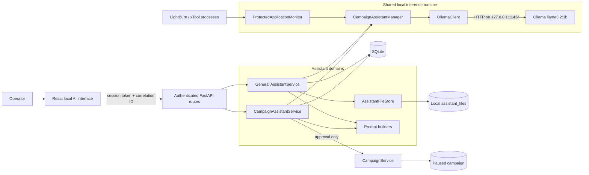
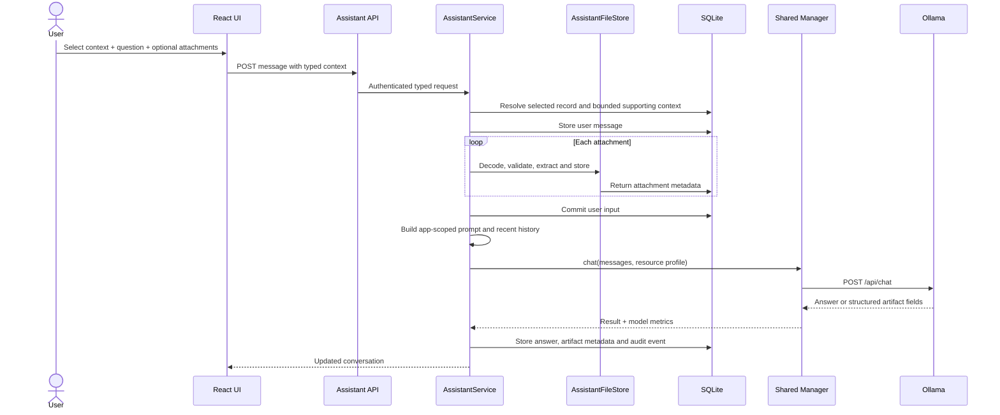
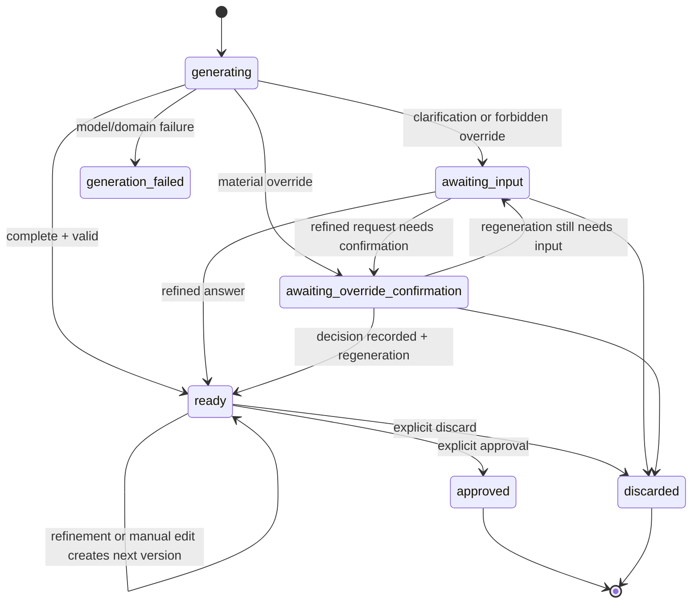
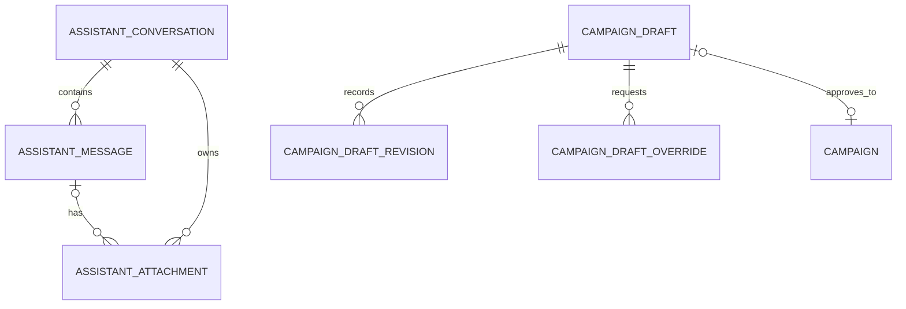

# Local AI integration architecture

- **Status:** Implemented
- **Updated:** 27 September 2026
- **Runtime:** Ollama 0.33.2 with `llama3.2:3b`
- **Decision records:** [ADR-018](../adr/ADR-018-local-campaign-assistant.md), [ADR-019](../adr/ADR-019-general-local-assistant-and-files.md) and [ADR-020](../adr/ADR-020-brand-and-operator-identity.md)
- **Revision history:** 2026-08-29 — initial version covering ADR-018 and ADR-019.
  2026-08-29 — architecture review pass: closed the `assistant_files` backup gap (migration
  `0014_backup_manifest_assistant_files`), backfilled campaign/general-assistant test coverage
  (§21), and added the threat-model, single-process and model-pinning guidance in §2/§16/§20.
  2026-08-29 — added outreach refinement, lead-filter translation, lead briefing, reviewed
  context autofill and deterministic stalled-lead triage on the shared local runtime.
  2026-08-29 — restricted general chat to an app-scoped copilot with bounded live workspace
  context and documented the built-in playbook fallback.
  2026-08-30 — added an explicit per-request context selector and server-resolved campaign, lead,
  outreach-batch and shortlist context, with record-level **Ask AI** handoffs into the dedicated
  assistant workspace.
  2026-09-27 — added the shared brand and operator identity (ADR-020) to every prompt builder,
  served at three token-budgeted tiers from `app/domains/brand/profile.py` (§22).
  Update this line whenever a change described in §20 lands, so drift between this document and
  the code is visible at a glance.

## 1. Purpose

This document is the implementation reference for every AI-assisted feature in the Etch 'N'
Shine Lead Generation application. It describes the current local runtime, trust boundaries,
app-scoped copilot, file handling, campaign drafting, playbook overrides, approval controls,
resource protection, persistence and supported extension paths.

The integration has two related capabilities:

1. **App-scoped local copilot:** answers questions grounded in the application and its bounded
   live workspace context, and prepares app-related templates, playbooks, checklists, tables and
   downloadable files.
2. **Guarded campaign assistant:** converts a request or app-copilot conversation into a
   complete campaign draft for review, override confirmation, editing and explicit approval.

Both capabilities share one local Ollama manager, but they deliberately use different prompts,
output contracts and authority boundaries.

## 2. Non-negotiable invariants

- AI inference runs on the local workstation through loopback-only Ollama. No paid AI API is
  called.
- The configured model is restricted to `llama3.2:3b`.
- General chat has no application tools and cannot claim to browse the web, inspect other
  applications, send a message or change application data.
- General-chat record context is selected by typed `{kind, id}` data. The backend resolves the
  record from SQLite and rejects missing or stale IDs; the frontend never supplies trusted record
  details in the prompt.
- Campaign-model output is advisory and schema-constrained. Backend domain validation remains
  authoritative.
- General chat can prepare a campaign brief, but it cannot create a campaign directly.
- A campaign exists only after a separate authenticated approval request.
- An AI-created campaign is always created paused, with weekly outreach disabled.
- A material departure from an overridable campaign-playbook recommendation requires a stored,
  explicit operator decision before draft generation continues.
- Provider availability, provider query limits, paused creation and disabled weekly outreach are
  hard constraints and cannot be overridden.
- Ollama uses its normal resource profile unless LightBurn or xTool Creative Space is actually
  detected and resource protection is enabled.
- Only one Ollama generation can run at a time.
- The backend runs as exactly one OS process (`uvicorn.run` with no worker pool). The generation
  lock in `CampaignAssistantManager` and the process-monitor state in
  `ProtectedApplicationMonitor` are in-process Python objects, not distributed locks. Introducing
  multiple worker processes, autoreload-spawned duplicates, or horizontal scaling would silently
  break single-generation serialization and protected-resource detection; concurrency control
  would need to move to an external mechanism (file lock, single-writer service, etc.) first.
- Backup/restore covers `assistant_files` file bytes: `BackupService.create` bundles the directory
  into a checksummed sibling archive (`{backup}.assistant_files.zip`), `verify` validates that
  archive alongside the database, and `restore_to_isolated_path` extracts it next to the restored
  database. A backup taken before this covered only the SQLite metadata and extracted text, not
  the file bytes; treat any backup older than migration `0014_backup_manifest_assistant_files` as
  not covering attachment bytes.
- AI suggestions from outreach refinement, lead briefing and lead-context autofill are never
  persisted automatically. The operator must use the existing draft save, note save or bulk lead
  update action. Filter translation remains client state, and stalled-lead triage has no save
  action.
- Outreach refinement, filter translation, briefing, autofill and stalled triage all use the same
  non-reentrant `CampaignAssistantManager` lock as campaign generation and general chat.
- Stalled-lead selection is deterministic backend logic. The model only suggests text for the
  selected IDs, and returned IDs are checked again against that set.
- Natural-language lead filtering only sets the existing structured filters. It does not search
  communication or note content and does not bypass the existing client-side matching logic.
- Website `visible_text` supplied to autofill is capped at 3,000 characters, remains in memory for
  one prompt and is never persisted to a lead or source observation.
- Every schema supplied to Ollama remains fully inline and excludes `$defs` and `maxLength`;
  Pydantic enforces response length limits after generation.

## 3. System context

There is no direct frontend-to-Ollama connection. The React interface always goes through the
authenticated local API, which supplies trusted context and enforces domain rules.

## 4. Component responsibilities

| Component | Current implementation | Responsibility |
|---|---|---|
| Local AI interface | `AssistantWorkspace.tsx`, `CampaignAssistantTab.tsx`, `GeneralAssistantPanel.tsx` | Presents the dedicated left-navigation **AI assistant** workspace with app-scoped **App copilot** and **Campaign draft** modes, an explicit context selector, file selection, conversation history, campaign review, override decisions and approval. Record-level **Ask AI** actions open this workspace with the relevant context selected. |
| General assistant API | `app/api/routes/assistant.py` | Authenticated conversation, message, download and campaign-handoff endpoints. |
| Campaign assistant API | `app/api/routes/campaign_assistant.py` | Authenticated status, generation, refinement, manual edit, override decision, approval and discard endpoints. |
| `AssistantService` | `app/domains/assistant/service.py` | Persists general conversations, prepares prompt history, invokes local chat, saves generated artifacts and assembles campaign-handoff briefs. |
| `CampaignAssistantService` | `app/domains/campaign_assistant/service.py` | Owns draft state, trusted campaign context, deterministic post-processing, playbook overrides, revisions, validation and approval. |
| `AssistantFileStore` | `app/domains/assistant/files.py` | Validates, extracts, creates, stores and safely resolves local assistant files. |
| App-context builder | `app/domains/assistant/context.py` | Resolves the selected campaign, lead, outreach batch or shortlist from SQLite, then builds a bounded live snapshot of that primary record and supporting workspace data. |
| Copilot prompt builder | `app/domains/assistant/prompt.py` | Restricts answers to the app/workspace, inserts the live snapshot and safely inserts extracted attachment context. |
| Campaign prompt builder | `app/domains/campaign_assistant/prompt.py` | Supplies the versioned playbook, workspace context, current draft and confirmed decisions to a structured campaign request. |
| `CampaignAssistantManager` | `app/domains/campaign_assistant/manager.py` | Serialises all generations, chooses the resource profile and unloads the model when required. |
| `ProtectedApplicationMonitor` | `app/domains/campaign_assistant/monitor.py` | Polls exact Windows process names and reports LightBurn/xTool state. |
| `OllamaClient` | `app/domains/campaign_assistant/ollama.py` | Owns loopback Ollama HTTP calls, model status, structured decoding, metrics and unload requests. |
| Repositories and SQLite | `app/db/models.py` and domain repositories | Persist conversations, messages, attachment metadata, drafts, revisions, override decisions and approval linkage. |
| `CampaignService` | `app/domains/campaigns/service.py` | Creates the real campaign after all assistant-specific gates pass. |

## 5. API surface

All paths are under `/api/v1`, require the local `X-Session-Token`, and receive a correlation ID.

### General assistant

| Method and path | Purpose |
|---|---|
| `GET /assistant/conversations` | List persistent conversations, newest first. |
| `POST /assistant/conversations` | Create a conversation with an optional title. |
| `GET /assistant/conversations/{conversation_id}` | Load one conversation and its ordered messages/files. |
| `POST /assistant/conversations/{conversation_id}/messages` | Resolve the typed `{kind, id}` context selection, store a user message and optional files, invoke Ollama, then store the answer and any generated artifact. |
| `GET /assistant/conversations/{conversation_id}/attachments/{attachment_id}` | Download an authenticated uploaded or generated file. |
| `POST /assistant/conversations/{conversation_id}/campaign-draft` | Convert recent conversation/playbook context into a guarded campaign draft. |

### Campaign assistant

| Method and path | Purpose |
|---|---|
| `GET /campaign-assistant/status` | Report enablement, Ollama/model status, model load state and active resource profile. |
| `POST /campaign-assistant/drafts` | Start a schema-constrained campaign draft. |
| `GET /campaign-assistant/drafts` | List drafts, optionally filtered by status. |
| `GET /campaign-assistant/drafts/{draft_id}` | Load a draft with revision and override history. |
| `POST /campaign-assistant/drafts/{draft_id}/messages` | Refine a draft using optimistic version control. |
| `PATCH /campaign-assistant/drafts/{draft_id}` | Apply validated manual form edits. |
| `POST /campaign-assistant/drafts/{draft_id}/overrides/{override_id}/decision` | Confirm, partially confirm or reject a proposed override. |
| `POST /campaign-assistant/drafts/{draft_id}/approve` | Create exactly one paused campaign from the current ready version. |
| `POST /campaign-assistant/drafts/{draft_id}/discard` | Close a non-approved draft. |

### Lead and outreach assistance

| Method and path | Purpose |
|---|---|
| `POST /outreach/drafts/{draft_id}/refine` | Suggest revised subject/body text without saving a revision. |
| `POST /lead-assistant/search-filter` | Translate plain English into the existing lead filter fields. |
| `POST /lead-assistant/leads/{lead_id}/briefing` | Generate a read-only pre-contact briefing. |
| `POST /lead-assistant/autofill` | Suggest missing context for up to 20 reviewed leads without saving. |
| `PATCH /leads/bulk` | Explicitly persist a reviewed set of lead changes atomically. |
| `POST /lead-assistant/stalled-digest` | Generate next-action text for deterministically selected stalled leads. |

## 6. App-copilot flow

### App-copilot prompt contract

- Prompt version: `app-copilot-v2`.
- The copilot answers only about the application, its workflows and the supplied local workspace
  snapshot. It redirects unrelated questions instead of acting as a generic chatbot.
- Every message carries one explicit context selection: whole workspace, campaign, lead, outreach
  batch or weekly shortlist. Whole workspace is the default.
- A record selection makes the exact server-resolved record the primary context. The assistant
  names that record and treats the remaining bounded workspace snapshot only as supporting
  context. **Ask AI** actions on records set this selection before opening the dedicated AI tab.
- Selected IDs are resolved before the user message is persisted. A missing or stale record
  returns HTTP 404 `ASSISTANT_CONTEXT_NOT_FOUND` without calling Ollama or storing the message.
- Each request also receives current operational counts and settings plus a context-dependent,
  bounded set of campaigns, relevant leads, follow-ups, catalogue, product-family, template and
  outreach-draft data.
- App-related planning content and downloadable artifacts remain supported.
- It has no web access and must not imply current external knowledge unless supplied by the user.
- It has no tool calls or direct application actions.
- Up to the last 12 persisted messages are supplied to the model.
- Extracted attachment text is inserted between explicit `ATTACHMENT` markers and treated as
  untrusted reference material.
- Total attachment text supplied across a request defaults to 30,000 characters, shared across all
  attachments in the retained window. The budget is consumed in message order (oldest of the last
  12 messages first) and, within a message, in attachment order; once exhausted, later attachments
  in the same request are not truncated further, they are omitted from the prompt.
- A request for TXT, CSV or DOCX changes the Ollama call to a small structured artifact response:
  `assistant_message`, `artifact_filename` and `artifact_content`.
- DOCX packaging happens locally after generation. The model returns text, not arbitrary binary
  office data.

The user message and uploads are committed before inference. If Ollama fails, the input remains
in the conversation for diagnosis or retry, but no assistant response or successful-generation
audit event is written.

## 7. Attachment and artifact architecture

### Accepted uploads

| Type | Validation and model behavior |
|---|---|
| TXT | Filename, base64, size, NUL-byte and UTF-8 validation; text is extracted locally. |
| CSV | Same text validation as TXT; supplied as reference text rather than parsed into application records. |
| DOCX | ZIP/DOCX structure and `word/document.xml` validation; text is extracted locally with an expansion limit. |
| PNG | PNG signature validation; stored locally, but no visual content is supplied to the text-only model. |
| JPG/JPEG | JPEG signature validation; stored locally, but no visual content is supplied to the text-only model. |

Current limits are four files per message and 5 MB per file. TXT and CSV must use UTF-8. Legacy
`.doc` is not supported.

### Generated files

- Supported formats are TXT, CSV and DOCX.
- The requested format is inferred from explicit wording such as “as CSV”, “Word document” or
  “text file”. Template, playbook and downloadable-file requests default to TXT unless another
  format is explicit.
- CSV output is instructed to contain a header row.
- DOCX is assembled locally from escaped text into a minimal Open XML package.
- Generated and uploaded files share the same authenticated download path.

### Storage

- Metadata and extracted text are stored in SQLite table `assistant_attachment`.
- File bytes are stored beneath
  `%LOCALAPPDATA%\EtchNShine\LeadGeneration\assistant_files` by default.
- Storage names are random UUID-based names. The original filename is display/download metadata
  only and is never trusted as a filesystem path.
- Every stored file has a SHA-256 value in its metadata.
- Download resolution verifies that the final path remains within the assistant file root.

## 8. Conversation-to-campaign handoff

The **Prepare campaign** action is an explicit boundary, not an implicit tool call. It collects up
to the latest 10 messages and readable attachment excerpts, produces a campaign-oriented brief,
and calls the existing `CampaignAssistantService.generate` method.

The current brief is capped at approximately 2,000 characters. Because the most recent end of the
transcript is retained, a long conversation should finish with a concise final campaign request or
playbook summary. This limit should be revisited before larger local models or retrieval are added.

The handoff returns a campaign draft only. It does not bypass clarification, playbook-override,
validation or approval states.

## 9. Campaign-draft flow

The campaign prompt uses `campaign-planner-v2` and requests exactly one schema-constrained outcome:

| Outcome | Persisted draft state | Meaning |
|---|---|---|
| `draft_ready` | `ready` | A complete validated draft is available for review/editing. |
| `clarification_required` | `awaiting_input` | Audience or location is genuinely missing. |
| `confirmation_required` | `awaiting_override_confirmation` | One or more material, overridable departures require a decision. |
| `override_not_allowed` | `awaiting_input` | The request conflicts with a hard constraint; the closest valid route is explained. |

Every generation/edit produces an immutable `campaign_draft_revision`. The mutable draft record
points at the current version. Refinement, editing, override decisions, approval and discard use
`expected_version` to reject stale UI actions.

### Trusted context supplied to campaign generation

- Workspace radius and shortlist defaults.
- Provider query limits and currently available discovery sources.
- Whether Instagram and Google Places are configured.
- Active catalogue categories and product families.
- Supported channels, discovery modes, offer settings and other campaign enums.
- The current campaign payload for refinement.
- Recorded confirmed/rejected override items.
- The versioned campaign playbook.

The model never queries the database or providers itself.

## 10. Campaign playbook and override protocol

### Recommendation rules

The current playbook recommends a focused audience, local default radius, focused keywords,
relevance exclusions, conservative shortlist/quality settings, catalogue relevance and explicit
confirmation before selecting a potentially billable provider.

This playbook is built into the campaign planner and is always supplied by the backend. A custom
playbook created in App copilot or uploaded by the operator is optional supporting context, not a
prerequisite for starting or approving a campaign draft.

### Hard constraints

- Do not exceed the configured provider query limit.
- Select only providers reported as available by trusted context.
- Keep assistant-created campaigns paused.
- Keep weekly outreach disabled.

### Override sequence

1. The model returns `confirmation_required` with the rule, field, normal recommendation,
   requested value and impact.
2. The backend rejects unknown rule IDs and any attempt to override a hard constraint.
3. The request is stored in `campaign_draft_override` with individual pending items.
4. The operator confirms, partially confirms or rejects the items against the current draft
   version.
5. The decision is persisted before regeneration.
6. Confirmed structured values are applied deterministically after model output; rejected items
   retain the playbook recommendation.
7. The backend independently detects unconfirmed radius, shortlist/threshold and billable-provider
   departures even if the 3B model failed to flag them.
8. The final result must pass the complete campaign validator before becoming `ready`.

Changing the playbook requires a new prompt/playbook version, migration-safe compatibility with
existing decisions, and regression tests for both compliant and overridden values.

## 11. Deterministic campaign validation

Before a proposal is persisted as ready, the backend:

- reapplies workspace defaults for radius, shortlist size and minimum score when the user did not
  explicitly request alternatives;
- reapplies confirmed structured overrides exactly;
- always includes manual discovery;
- removes unavailable providers and records a warning;
- derives manual/combined discovery mode from the remaining providers;
- forces `status = paused`;
- forces `weekly_outreach_enabled = false`, clears the weekly template and uses the scoring
  outreach provider;
- enforces the provider keyword/query limit;
- rejects unsupported channels and offer settings;
- rejects catalogue categories or product-family IDs that do not exist;
- rejects duplicate campaign names; and
- shows a cost warning only when configured Google Places is actually selected.

Manual editing uses the same campaign schemas and hard constraints. Model output never becomes a
campaign merely because it is syntactically valid JSON.

## 12. Approval boundary

Approval is a separate authenticated endpoint and is the only assistant path that calls
`CampaignService.create`.

Approval requires:

- the exact current draft version;
- draft state `ready`;
- a complete current payload;
- no pending override request; and
- a fresh pass through deterministic campaign validation.

The draft stores a unique `approved_campaign_id`. Repeating approval for an already approved draft
returns the linked campaign rather than creating a duplicate. Approval never starts discovery or
weekly outreach.

## 13. Shared resource and concurrency policy

| Condition | Context | Output limit | Keep-alive | Behavior after request |
|---|---:|---:|---|---|
| No protected application detected | 8,192 tokens | 1,200 tokens | 5 minutes | Model may remain loaded for responsive follow-up. |
| LightBurn or xTool detected and protection enabled | 4,096 tokens | 900 tokens | 0 | Model is unloaded after the request. |
| Protection disabled in workspace settings | 8,192 tokens | 1,200 tokens | 5 minutes | Standard behavior even if a protected process is open. |

Exact configured process names are `lightburn.exe`, `xcs.exe` and
`xtool creative space.exe`. The background monitor checks every 10 seconds by default. If a
protected application starts during a generation, that generation is allowed to finish and the
model is then unloaded.

A single non-blocking lock is shared by general chat and campaign generation. A second concurrent
request receives HTTP 409 with `CAMPAIGN_ASSISTANT_BUSY`; it is not silently queued. This prevents
multiple model instances or overlapping generations from competing for workstation resources.

## 14. Ollama boundary and lifecycle

- `ollama_base_url` accepts only loopback HTTP hosts: `127.0.0.1`, `localhost` or `::1`.
- Model configuration accepts only `llama3.2:3b`.
- Startup opens the Ollama HTTP client and process monitor when runtime AI is enabled.
- Status reads Ollama `/api/tags` and `/api/ps` to distinguish reachable, installed and loaded.
- General and campaign inference use Ollama `/api/chat`.
- Campaign calls provide a full structured JSON schema.
- Artifact calls provide a smaller format-specific structured schema.
- Unload sends `/api/generate` with `keep_alive: 0`.
- Application shutdown stops the monitor, unloads the model and closes the client.

No Ollama tool definitions are supplied, so the model cannot invoke filesystem, application,
provider, campaign or messaging actions.

## 15. Persistence model

### General-assistant records

- `assistant_conversation`: title and created/updated timestamps.
- `assistant_message`: role, content, model, resource profile, duration and campaign-handoff hint.
- `assistant_attachment`: direction, safe display name, media type, size, SHA-256, random storage
  name, extracted text and processing status.

### Campaign-assistant records

- `campaign_draft`: current state/payload/version, original request, model and prompt metadata,
  generation metrics and approved-campaign link.
- `campaign_draft_revision`: immutable payload and response snapshot for each version.
- `campaign_draft_override`: originating message, playbook version, item-level decisions and
  decision timestamps.

## 16. Security and privacy controls

- The desktop API and Ollama both remain on loopback.
- Every assistant API route requires the random local session token.
- Prompts and request bodies are not written to application logs.
- User text and extracted attachment content are explicitly treated as untrusted prompt input.
- Pydantic models forbid unexpected request/response fields at important AI boundaries.
- Campaign output is parsed against a strict schema and then independently domain-validated.
- File extensions, signatures, base64, size and encoding are validated before use.
- Original filenames cannot choose a storage path.
- Downloads are authenticated and protected against directory traversal.
- React renders assistant output as text, not raw model-provided HTML.
- Successful generation and campaign lifecycle actions write audit events with correlation IDs,
  model/prompt/resource metadata and safe summaries.
- The current local files are not encrypted by this feature. Workstation account access and
  operating-system storage controls protect them, so sensitive unnecessary uploads should be
  avoided.

Current audit actions are `assistant.message.generated`, `campaign_draft.generated`,
`campaign_draft.edited`, `campaign_draft.approved` and `campaign_draft.discarded`. Override state
is preserved in its own durable record and included in approval evidence.

There is no telemetry or metrics collection beyond these per-request audit rows (no latency
histograms, failure-rate counters or override-rejection rates). This is a deliberate choice for a
single-user local desktop tool rather than an oversight; the audit table is the complete
historical record.

### Threat model

- **Prompt injection via untrusted content.** Attachment text and prior conversation content are
  explicitly untrusted (§16) and reach the model unescaped inside `ATTACHMENT` markers. A crafted
  attachment or message could try to make the model claim it browsed the web, sent a message,
  modified a campaign, or that a campaign was already approved. The no-tools boundary and
  schema-constrained campaign output prevent such claims from taking effect. Nothing scans
  free-text `assistant_message` content for false action claims before it reaches the UI, but
  `test_attachment_content_cannot_override_the_system_prompt_or_take_action` in
  `test_general_assistant.py` asserts the structural mitigation: the system role sent to the model
  is never altered by attachment content, and even a fake manager simulating a worst-case model
  that falsely claims a campaign was created and approved leaves no campaign in the database. The
  same class of test does not yet exist for the campaign assistant path specifically (§19, §21).
- **Attachment expansion abuse.** DOCX extraction enforces an expansion limit (§7); this bounds a
  zip-bomb-style DOCX from exhausting memory during extraction. The same class of check should be
  re-verified whenever a new compressed attachment type is added (§20).
- **Filename-based path abuse.** Mitigated: storage uses random UUID names, and download
  resolution verifies the resolved path stays under the assistant file root (§7, §16).
- **Cross-conversation data exposure.** Every read is scoped by conversation/draft ownership under
  the authenticated session; there is no cross-tenant concern because the tool is single-operator
  and local-only.

## 17. Configuration reference

| Environment setting | Default | Purpose |
|---|---|---|
| `ENS_CAMPAIGN_ASSISTANT_ENABLED` | `true` | Runtime manager lifecycle and campaign-assistant availability. |
| `ENS_OLLAMA_BASE_URL` | `http://127.0.0.1:11434` | Loopback Ollama endpoint. |
| `ENS_OLLAMA_MODEL` | `llama3.2:3b` | Pinned local model. |
| `ENS_OLLAMA_TIMEOUT_SECONDS` | `120` | Per-request Ollama timeout. |
| `ENS_OLLAMA_STANDARD_CONTEXT` | `8192` | Normal context limit. |
| `ENS_OLLAMA_PROTECTED_CONTEXT` | `4096` | Context limit while protected software is active. |
| `ENS_OLLAMA_STANDARD_OUTPUT_LIMIT` | `1200` | Normal output-token limit. |
| `ENS_OLLAMA_PROTECTED_OUTPUT_LIMIT` | `900` | Protected-mode output-token limit. |
| `ENS_OLLAMA_STANDARD_KEEP_ALIVE` | `5m` | Normal model residency after a call. |
| `ENS_ASSISTANT_ATTACHMENT_MAX_BYTES` | `5242880` | Maximum size of each uploaded/generated file. |
| `ENS_ASSISTANT_ATTACHMENT_CONTEXT_CHARS` | `30000` | Maximum extracted attachment context per chat request. |
| `ENS_PROTECTED_APP_POLL_SECONDS` | `10` | Process-monitor interval. |
| `ENS_LEAD_STALE_AFTER_DAYS` | `21` | Activity age used by on-demand stalled-lead selection. |

Workspace settings separately control `local_campaign_assistant_enabled` and
`protect_design_software_resources`. Runtime configuration is a deployment-level control;
workspace configuration is the operator-facing control.

## 18. Failure and degradation behavior

| Condition | Expected behavior | Recovery |
|---|---|---|
| Ollama unavailable | Status reports not reachable; generation returns a safe domain error. | Start Ollama and retry; all manual workflows remain available. |
| Model not installed | Status names the missing pinned model. | Run `ollama pull llama3.2:3b`. |
| Generation already active | Second request returns HTTP 409. | Wait for the active local response and retry. |
| Timeout or invalid model response | General input remains stored; campaign draft becomes `generation_failed`. | Retry/refine or use manual campaign creation. |
| Missing campaign audience/location | Draft becomes `awaiting_input` with up to three questions. | Answer in campaign chat. |
| Unconfirmed material override | Draft becomes `awaiting_override_confirmation`. | Confirm, partially confirm or reject. |
| Unsupported/unavailable provider | Hard failure or provider removal with a visible warning, depending on the violation. | Choose an available provider or configure it first. |
| Invalid attachment | Request returns an explicit 4xx error before model use. | Correct format, encoding or size and attach again. |
| Design software starts mid-call | Current request finishes, then Ollama unloads. | Subsequent calls use protected mode while it remains open. |

Malformed or schema-violating model output (invalid JSON, a validation failure against the
structured contract) is treated the same as a timeout: no automatic retry or repair prompt is
issued. This is a deliberate simplicity-over-resilience choice for a 3B local model — the operator
retries or refines manually — not an oversight. If malformed output proves common in practice, the
lowest-risk improvement is one bounded automatic retry that re-prompts with the validation error
before surfacing `generation_failed`; this should be evaluated against real failure rates rather
than added speculatively.

## 19. Known limitations and follow-up work

- `llama3.2:3b` is text-only. JPEG/PNG attachments are retained but cannot be visually analysed.
- There is no live web search, retrieval index, image generation, application-tool calling or
  autonomous action execution.
- Responses are returned after completion; token streaming is not implemented.
- The single-generation lock rejects rather than queues concurrent work.
- General chat uses a rolling 12-message window and a character-limited attachment context.
- Campaign handoff currently retains only an approximately 2,000-character recent transcript.
- Conversation rename/delete and attachment-retention controls are not yet exposed in the UI.
- Backup/restore now covers `assistant_files` bytes as of migration
  `0014_backup_manifest_assistant_files` (§7, §23). Remaining gap: the bundle is a single ZIP
  archive with no incremental/delta strategy, so a workstation with a very large accumulated
  `assistant_files` directory will see backup time and size grow linearly with total attachment
  history, not just recent activity. Revisit if that becomes noticeable in practice.
- Workspace disablement is enforced by the campaign-assistant workflow and UI. If the general
  assistant API is ever exposed beyond the current desktop UI, add an explicit server-side
  workspace-enable check to its message and handoff routes.
- Automated test coverage for the AI surface covers all four campaign-draft outcomes, every
  override decision path (confirm/partial/reject), manual editing, discard, optimistic-version
  conflicts and unavailable-provider removal (§21). Remaining gaps: the `DESIGN_SOFTWARE` resource
  profile is covered at the manager-unit level but not through a full API-level draft generation,
  and there is no automated coverage yet for prompt-injection resistance against the campaign
  assistant specifically (only the general assistant has a regression test for this, per §16).
- The concurrency and resource-protection model assumes a single backend process (§2). This is
  true today but is not enforced by anything other than the launch command in `cli.py`; a future
  packaging or ops change that adds worker processes would silently defeat it.
- No automatic retry or repair prompt exists for malformed structured model output (§18); this is
  a deliberate choice, revisit only if real-world failure rates justify the added complexity.

## 20. Extension rules

### Add or change a campaign playbook rule

1. Add the rule with a stable ID and classify it as a recommendation or hard constraint.
2. Increment the campaign prompt/playbook version.
3. Add deterministic detection/application for structured fields where model compliance is not
   sufficient.
4. Preserve compatibility with stored historical override decisions.
5. Test compliant defaults, requested overrides, rejection, partial confirmation and approval.

### Add an attachment type

1. Define its extension and canonical MIME type.
2. Validate its binary signature and expansion limits locally.
3. Add a bounded text extractor or explicitly mark it unavailable to the current model.
4. Update backend schemas, frontend accept rules, user guidance and security tests.
5. Never infer content from the filename alone.

### Add a generated artifact type

1. Add a structured model response contract.
2. Generate the binary format locally from plain, escaped model content.
3. Keep random storage names and authenticated downloads.
4. Add size, validity and download tests.

### Add a vision model

Use a separate, explicitly configured local model adapter and prompt contract. Confirm memory and
resource behavior on the target machine, add safe image decoding/dimension limits, and preserve
the same no-tools boundary. Do not silently route images to a cloud service.

### Add an AI-triggered application action

Do not add tools to general chat. Introduce a typed intent/handoff endpoint owned by the target
domain, show the proposed action and effects, require the appropriate explicit approval, then
revalidate all domain rules server-side. Follow the existing conversation-to-campaign pattern.

### Add a remote AI provider

Create a neutral provider port rather than changing domain services to depend on a vendor. Before
enablement, define consent, data minimisation, redaction, cost budgets, credential storage,
timeouts, audit metadata, provider retention terms and a complete local/manual fallback.

### Change the campaign draft schema

1. Add the field to the structured model contract and the deterministic validator together; a
   field the model can return but the validator never checks is not safe to trust.
2. Confirm `campaign_draft_revision` rows written under the previous schema still load: either
   give the new field a safe default when reading an old revision, or add an explicit migration
   step. Revisions are immutable snapshots, so old rows can never be rewritten to the new shape.
3. Update the playbook/override protocol (§10) if the field can be subject to an overridable
   recommendation or a hard constraint.
4. Bump the campaign prompt/playbook version and add regression tests covering both an old
   revision loaded read-only and a new draft using the new field.

### Change the pinned model

1. Treat this the same as changing the playbook: it can shift recommendation quality, JSON
   compliance and latency even at the same context/output limits.
2. Re-run the full verification matrix in §21 against the candidate model before repointing
   `ollama_model`, including the override and resource-profile tests.
3. Confirm the new tag's memory/CPU footprint on the target workstation class under the
   protected-resource profile (§13), not just the standard profile.
4. Prefer pinning to a specific Ollama model digest/tag rather than a mutable alias, so a
   background `ollama pull` cannot silently change behavior without a documented decision.

## 21. Required verification for future changes

This list is the verification bar for changes, not a description of current coverage. As of this
revision, `test_campaign_assistant.py` (16 cases), `test_general_assistant.py` (7 cases) and
`test_backup_restore.py` (2 cases) together cover: all four campaign-draft outcomes
(`draft_ready`, `clarification_required`, `confirmation_required`, `override_not_allowed`); full
override confirm/partial/reject paths and hard-constraint refusal; manual editing with protected-
field rejection; discard; optimistic-version conflicts; unavailable-provider removal; attachment
handling and unsupported-attachment rejection; the conversation-to-campaign handoff; a structural
prompt-injection regression test for the general assistant; and backup/restore of both the
database and `assistant_files` bytes, including tamper detection on each. Still open against the
list below: resource-profile behavior is exercised at the `CampaignAssistantManager` unit level
(`test_model_is_restricted_only_while_protected_applications_are_active`) but not through a full
API-level draft generation under `DESIGN_SOFTWARE`; there is no campaign-assistant-specific
prompt-injection test (only general assistant, §16); and the frontend, live-Ollama-smoke and
desktop/Cargo checks below are unchanged and still to be run per release, not part of this
automated suite. Require any new AI-surface change to add tests from this list rather than
assuming it is already covered.

- Unit tests for prompts, schemas, validators, file signatures and resource-profile selection.
- API tests for authentication, error contracts, optimistic versions and download boundaries.
- Campaign tests proving that no campaign exists before approval and that approval creates one
  paused campaign with weekly outreach disabled.
- Override tests for detect, confirm, partial confirm, reject, hard-constraint refusal and exact
  application of confirmed values.
- Resource tests for standard mode, LightBurn/xTool protected mode, mid-call detection and disabled
  protection.
- Frontend interaction tests for general chat, attachments, generated downloads, handoff, editing,
  override confirmation and approval.
- Live local Ollama smoke tests for plain chat, artifact generation, normal campaign generation and
  at least one confirmed override.
- Full Ruff, formatting, strict mypy, ESLint, TypeScript, frontend build, backend regression and
  desktop Cargo checks.

## 22. Brand and operator identity

Decision record: [ADR-020](../adr/ADR-020-brand-and-operator-identity.md).

`apps/backend/app/domains/brand/profile.py` is the single source of truth for who the business
is, who the operator is and how Etch 'N' Shine is allowed to sound. Every prompt builder imports
`identity_block` from it rather than restating voice rules, so the surfaces cannot drift apart.
Its content mirrors the `etch-n-shine` brand-voice reference used elsewhere in the toolchain.

`identity_block(tier)` serves three token-budgeted tiers, because the standard window is 8,192
tokens and halves to 4,096 in the protected profile, where the workspace snapshot already
consumes most of it:

| Tier | Approximate cost | Used by |
|---|---|---|
| `BRIEF` | 300 tokens | Campaign planner, lead briefing, reviewed-context autofill, stalled-lead digest, and general chat while resources are protected |
| `CORE` | 1,100 tokens | General app copilot in the standard profile |
| `WRITING` | 1,500 tokens | Outreach draft refinement |

The lead-filter translator receives no identity block. Mapping a phrase onto dropdown values
needs no brand voice, and the context window is better spent on the candidate values.

Rules for changing this module:

- Identity is instruction-grade and belongs in the system prompt, above the trusted workspace
  snapshot. Never move it into the snapshot JSON, which the model is told to treat as data it
  must not obey.
- Bump `BRAND_PROFILE_VERSION` on any content change. `assistant.message.generated` audit events
  record it next to the prompt version, so stored conversations remain explainable.
- Keep worked examples labelled as calibration samples with an explicit instruction not to copy
  them. A 3B model otherwise lifts example sentences verbatim into outreach copy and drops the
  recipient's own details to make room. Verify this with a live refinement smoke test.
- Re-measure the tier costs after editing. `BRIEF` must stay small enough to leave the protected
  4,096-token window usable once the snapshot is added.
- Prefer facts the operator can act on over description. The profile exists to remove rework, not
  to document the brand.
- Never write a price, a price range or a count of anything into the profile. Pricing is the
  operator's to give, and the live workspace snapshot is authoritative for quantities, so a number
  written into the profile goes stale silently. The test suite enforces both.
- When a rule contradicts a task instruction, state which one wins. Outreach refinement is told to
  preserve concrete facts, so the price-stripping rule has to say explicitly that it overrides
  that. Without the precedence the model kept the figures.
- Keep the operator addressed as "you". Naming him without that instruction makes the copilot
  answer in the third person and tell the reader to ask Malek.

Coverage lives in `apps/backend/tests/test_brand_identity.py`, which asserts the tier budgets,
that every tier names the business, the operator, UK English and the banned phrases, and that
each prompt builder receives the tier it is supposed to receive.

## 23. Source map

| Concern | Source |
|---|---|
| General assistant UI | `apps/frontend/src/components/GeneralAssistantPanel.tsx` |
| Dedicated assistant workspace | `apps/frontend/src/components/AssistantWorkspace.tsx` |
| Combined assistant/campaign UI | `apps/frontend/src/components/CampaignAssistantTab.tsx` |
| Frontend API client | `apps/frontend/src/api.ts` |
| General API | `apps/backend/app/api/routes/assistant.py` |
| Campaign API | `apps/backend/app/api/routes/campaign_assistant.py` |
| General orchestration | `apps/backend/app/domains/assistant/service.py` |
| File validation/generation | `apps/backend/app/domains/assistant/files.py` |
| General prompt | `apps/backend/app/domains/assistant/prompt.py` |
| Campaign orchestration | `apps/backend/app/domains/campaign_assistant/service.py` |
| Campaign playbook/prompt | `apps/backend/app/domains/campaign_assistant/prompt.py` |
| Shared inference manager | `apps/backend/app/domains/campaign_assistant/manager.py` |
| Shared local-AI enabled gate | `apps/backend/app/domains/campaign_assistant/gate.py` |
| Protected app monitor | `apps/backend/app/domains/campaign_assistant/monitor.py` |
| Ollama adapter | `apps/backend/app/domains/campaign_assistant/ollama.py` |
| AI persistence models | `apps/backend/app/db/models.py` |
| AI migrations | `apps/backend/migrations/versions/0012_campaign_assistant_drafts.py`, `0013_general_assistant.py` |
| Backup/restore, including `assistant_files` bundling | `apps/backend/app/domains/backups/service.py`, `apps/backend/migrations/versions/0014_backup_manifest_assistant_files.py` |
| Runtime settings | `apps/backend/app/core/config.py` |
| Outreach refinement | `apps/backend/app/domains/outreach/prompt.py`, `service.py`, `apps/backend/app/api/routes/outreach.py` |
| Lead filter, briefing, autofill and digest | `apps/backend/app/domains/lead_assistant/`, `apps/backend/app/api/routes/lead_assistant.py` |
| Deterministic lead activity/staleness | `apps/backend/app/domains/leads/activity.py`, `apps/backend/app/domains/lead_assistant/staleness.py` |
| Brand and operator identity | `apps/backend/app/domains/brand/profile.py` |
| Workspace settings | `apps/backend/app/domains/system/schemas.py` |
| Backend tests | `apps/backend/tests/test_campaign_assistant.py`, `test_general_assistant.py`, `test_brand_identity.py`, `test_backup_restore.py` |
| Architecture decisions | `docs/adr/ADR-018-local-campaign-assistant.md`, `ADR-019-general-local-assistant-and-files.md`, `ADR-020-brand-and-operator-identity.md` |
