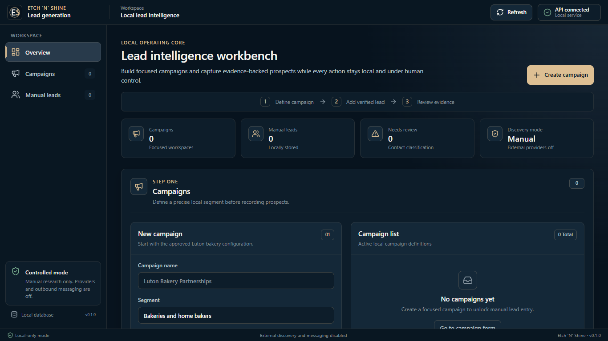
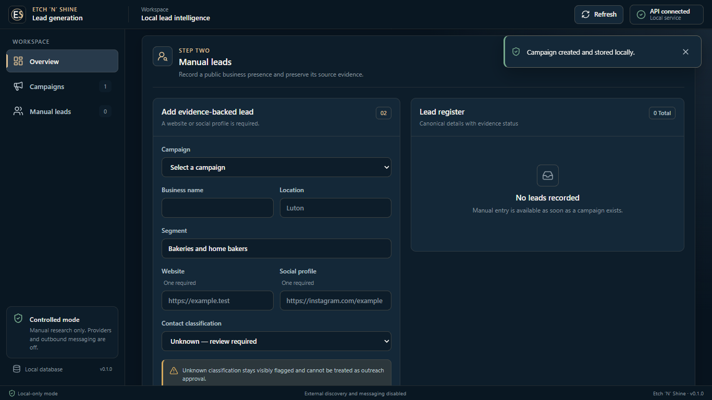
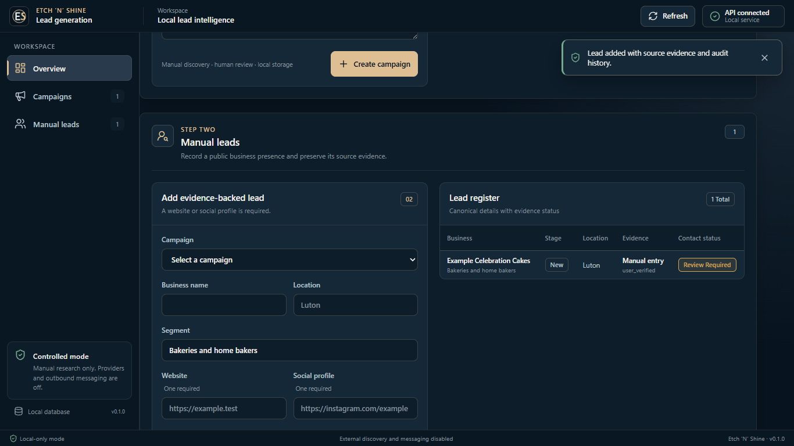
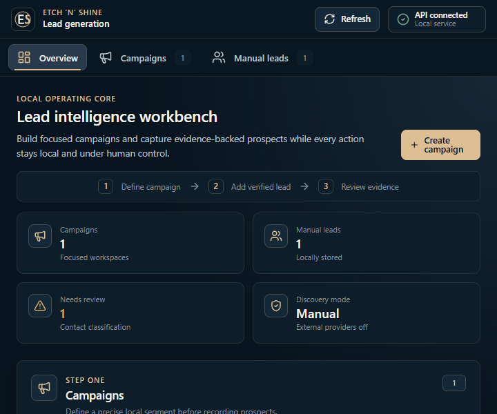

# Universal design-system review

**Date:** 18 July 2026  
**Scope:** Current campaign and manual-lead workflow  
**Result:** Verified with documented deviations

## Applied principles

| Area | Implementation |
|---|---|
| Brand | Deep-navy shell, blue-grey surfaces, off-white text, and restrained champagne-gold actions/focus/key values |
| Shell | 56px application header, 240px sidebar, main workspace and 28px status bar |
| Hierarchy | Page header, visible three-step workflow, four operating metrics, then campaign and lead work panels |
| Typography | Segoe UI-first sans-serif stack, sentence case and the documented compact type scale |
| Spacing/radius | Central 4px spacing scale; 6/8/10/12px radii; no ordinary pill buttons |
| Controls | Consistent 38px inputs, 44px primary actions, gold focus, clear optional/required and disabled states |
| Icons | Lucide only; 17–20px outline icons with text for major actions |
| Records | Compact campaign records and an operational lead table; mobile rows retain explicit field labels |
| Feedback | Checking/connected/unavailable, loading, success toast, actionable error, warning, disabled and empty states |
| Accessibility | Skip link, banner/navigation/main landmarks, labelled native controls, logical tab order, visible focus, textual status and reduced motion |

## Functional and visual regression

The redesign preserves campaign and lead defaults, API request structures, source evidence, human-control wording and local-only behaviour. A disposable real backend was used to create one campaign and one manual lead. Navigation counts, success feedback, campaign record, lead table, source evidence and review-required state all updated correctly. Browser console and page-error checks were clean.

Automated frontend coverage now includes shell landmarks, navigation state, campaign submission, lead submission and success feedback: 3 tests passed with 69.95% aggregate coverage.

## Resolution evidence

| Viewport | Result |
|---|---|
| 720×600 | Compact horizontal navigation, stacked metrics/work panels, no document-level horizontal overflow |
| 1366×768 | Required desktop shell and primary workflow visible; 240px sidebar and 56px header |
| 1440×900 | No horizontal overflow; two-column work panels retained |
| 1920×1080 | No horizontal overflow; content constrained for readable density |
| 2560×1440 | No horizontal overflow; content remains centred at its maximum width |

Keyboard verification confirmed that the first Tab exposes “Skip to main content” and Enter transfers focus to `main-content`. Local-development vitals were TTFB 13.2ms, FCP/LCP 328ms and CLS 0; these are diagnostic results, not production benchmarks.

### Screenshots

## Documented deviations

- No official full brand-logo asset was supplied. The existing Etch ’N’ Shine application monogram was retained and recoloured to the approved palette; it is used once, without decorative effects.
- The sidebar is fixed rather than user-resizable/collapsible. At widths below 900px it becomes compact horizontal navigation so the working area remains usable. Persistence and user-controlled collapse can be added when the navigation surface grows.
- There are no modal, tab, slider or destructive-action patterns in the current workflow, so speculative components for them were not introduced.
- Automated pixel-diff testing is not yet installed. The checked-in screenshots and browser assertions are the current regression evidence.
