# Workflow Audit: Etch N Shine Lead Generation

| Field | Value |
|-------|-------|
| **Date** | 19 July 2026 |
| **App URL** | `http://127.0.0.1:1421` (isolated copy of local data) |
| **Session** | `ens-workflow-audit`, then `ens-workflow-tabs` |
| **Scope** | Navigation accessibility, Campaigns, Leads, Catalogue, Shortlist, Pipeline, Settings |

## Summary

| Status | Count |
|--------|-------|
| Open | 0 |
| Resolved | 6 |
| **Total findings** | **6** |

## Workflow conclusion

All seven top-level screens are reachable from the persistent left navigation and the section labels/counts are understandable. Overview and Weekly shortlist remain focused single-purpose workspaces. Campaigns, All leads, Catalogue, Pipeline and Settings now use task-level tabs, and lead-opening actions route directly to the selected lead's Pipeline workspace. The task tabs expose semantic tab roles and support Left/Right/Home/End keyboard navigation.

## Verification

- Frontend interaction suite: 18/18 passing, including keyboard tab navigation.
- TypeScript typecheck, ESLint with zero warnings, production build and `git diff --check`: passing.
- Live browser retest: 1 campaign, 26 leads, 123 products and 1 shortlist using an isolated copy of local data.
- Viewports checked: 1366 × 768 and 1024 × 768.
- Browser errors: none.

## Issues

Findings are recorded during the audit and retained as implementation evidence.

### ISSUE-001: Campaigns combines four distinct workflows on one long page

| Field | Value |
|-------|-------|
| **Severity** | medium |
| **Status** | resolved |
| **Category** | ux |
| **URL** | `http://127.0.0.1:1421` → Campaigns |
| **Repro Video** | N/A — visible on load |

**Description**

Campaign operation history, duplicate review, assisted social capture, campaign creation/editing and the campaign register are presented sequentially. The page exposes more than thirty actionable controls at once, makes the primary task ambiguous and requires substantial scrolling. These are separate user intentions and should be grouped behind persistent task tabs.

**Evidence**

1. Open Campaigns and observe all workflows in one continuous workspace.
   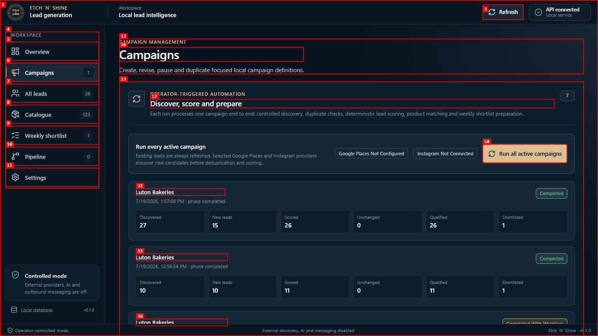

**Resolution verification**

Campaign register, Create campaign, Run automation and Social leads are now separate tasks. Only the selected workflow is rendered.
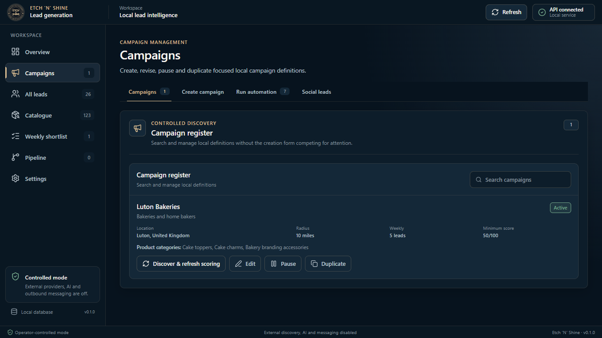

### ISSUE-002: Manage lead exits the lead register without opening lead controls

| Field | Value |
|-------|-------|
| **Severity** | high |
| **Status** | resolved |
| **Category** | functional / ux |
| **URL** | `http://127.0.0.1:1421` → All leads |
| **Repro Video** | N/A — recording was attempted but FFmpeg is unavailable on the test machine |

**Description**

Selecting **Manage** on a lead either leaves the register for Overview or produces no visible lead profile. The equivalent **Open lead** action in Weekly shortlist also produces no visible result. No lead profile or controls are displayed, so the expected management task has no usable destination.

**Repro Steps**

1. Open **All leads** and locate any row.
   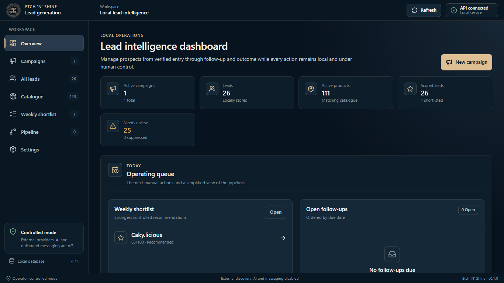

2. Click **Manage**.

3. **Observe:** the application displays the Overview dashboard rather than the selected lead.
   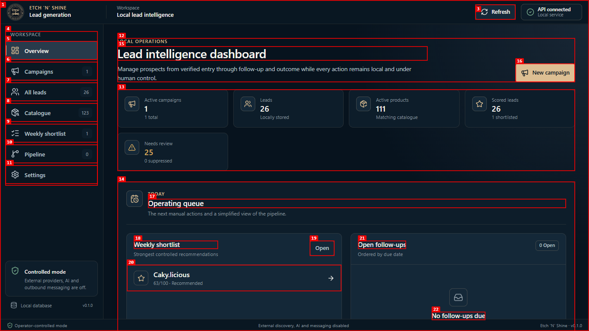

**Resolution verification**

Manage now selects the requested lead, opens Pipeline, resets the workspace scroll position and focuses the workspace. The live-data retest opened `Vellora_CreationsUK` and displayed its phone number and task tabs immediately.
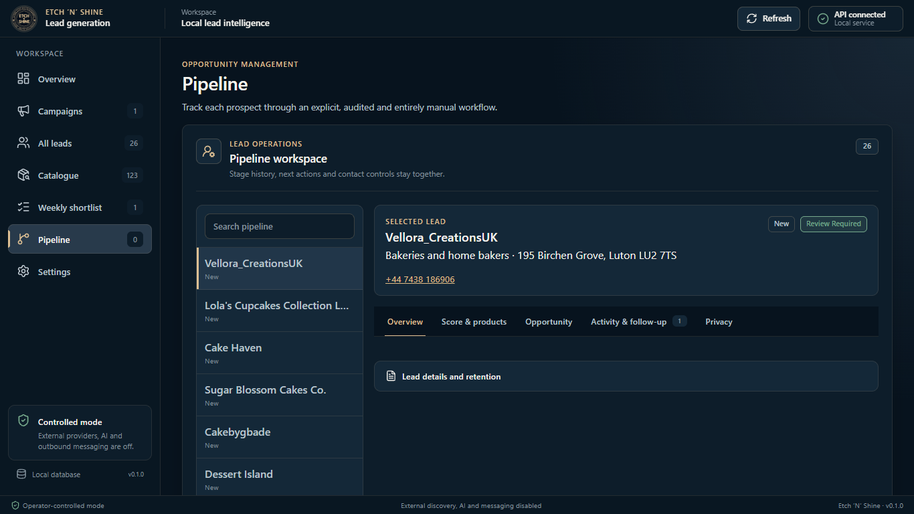

### ISSUE-003: Lead entry and lead browsing compete in the same workspace

| Field | Value |
|-------|-------|
| **Severity** | medium |
| **Status** | resolved |
| **Category** | ux |
| **URL** | `http://127.0.0.1:1421` → All leads |
| **Repro Video** | N/A — visible on load |

**Description**

The full manual-entry form appears before the searchable lead table. A user who primarily wants to review or manage leads must pass an unrelated form, while a user entering a lead is surrounded by the register. The section should open on a **Browse leads** tab with a separate **Add lead** tab; an opened lead should have task tabs for overview, scoring/products, activity/follow-up and privacy/contact controls.

**Evidence**

1. Open All leads and observe manual entry plus the register in one continuous region.
   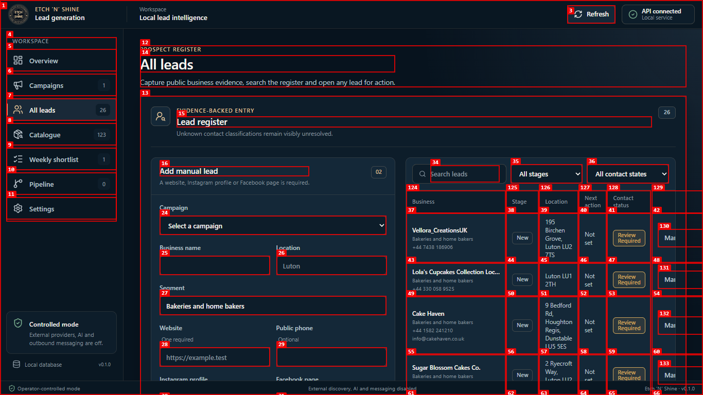

**Resolution verification**

All leads now opens on Browse leads; Add lead is an independent task.
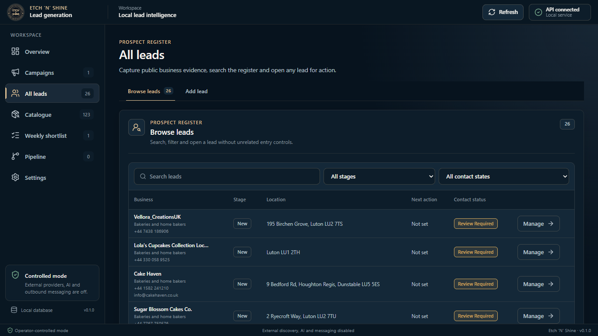

### ISSUE-004: Catalogue mixes import, model administration and product browsing

| Field | Value |
|-------|-------|
| **Severity** | medium |
| **Status** | resolved |
| **Category** | ux |
| **URL** | `http://127.0.0.1:1421` → Catalogue |
| **Repro Video** | N/A — visible on load |

**Description**

CSV import, scoring-model weights, product creation and product browsing are unrelated tasks but appear in one scrolling workspace. The default catalogue journey should prioritise browsing products, with separate **Import catalogue**, **Products** and **Scoring model** tabs.

**Evidence**

1. Open Catalogue and observe all three administration workflows together.
   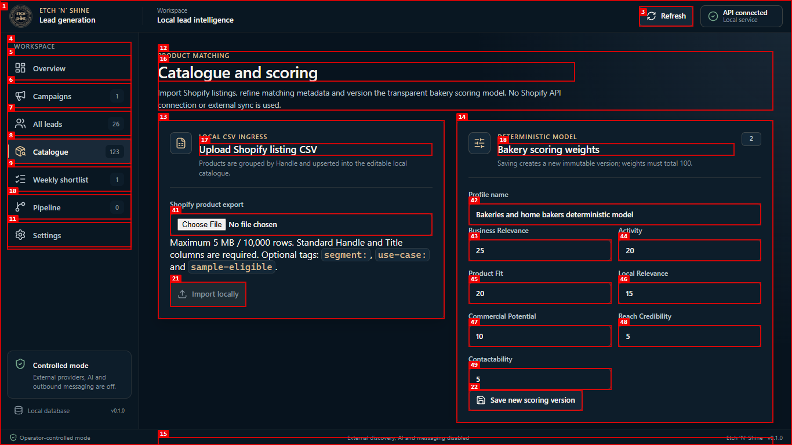

**Resolution verification**

Products, Add product, Import catalogue and Scoring model are now four independent tasks. Products opens as the browse-first default without manual-entry inputs.
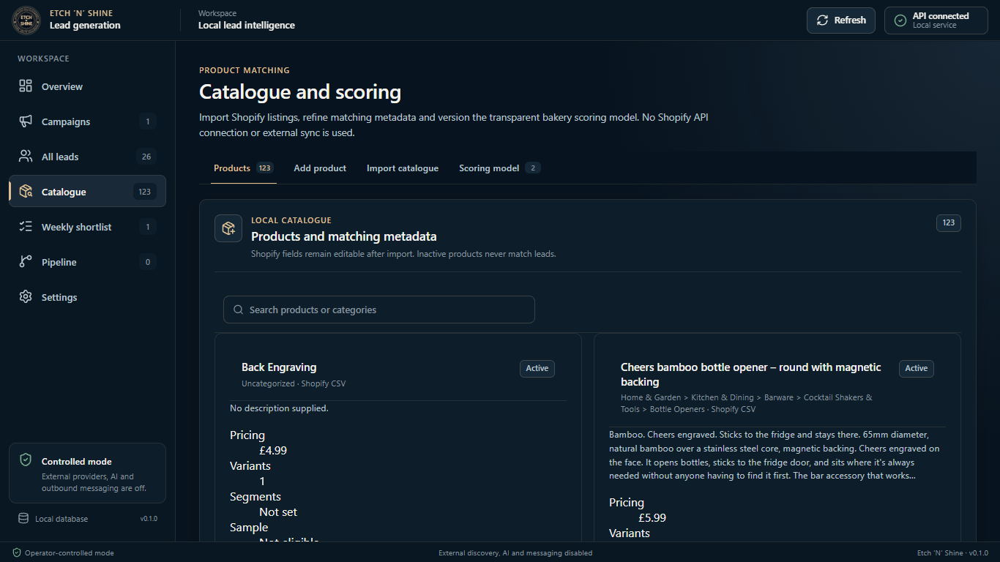

### ISSUE-005: Pipeline lead workspace exposes every control simultaneously

| Field | Value |
|-------|-------|
| **Severity** | medium |
| **Status** | resolved |
| **Category** | ux |
| **URL** | `http://127.0.0.1:1421` → Pipeline |
| **Repro Video** | N/A — visible on load |

**Description**

The selected lead shows scoring, manual override, pipeline stage, opportunity values, notes, follow-up creation, communication logging, suppression, deletion and the timeline in one continuous form. This is the densest screen in the application and mixes daily sales work with high-risk privacy actions. It should use lead task tabs: **Overview**, **Score & products**, **Opportunity**, **Activity & follow-up**, and **Privacy**.

**Evidence**

1. Open Pipeline and observe every lead action in one workspace.
   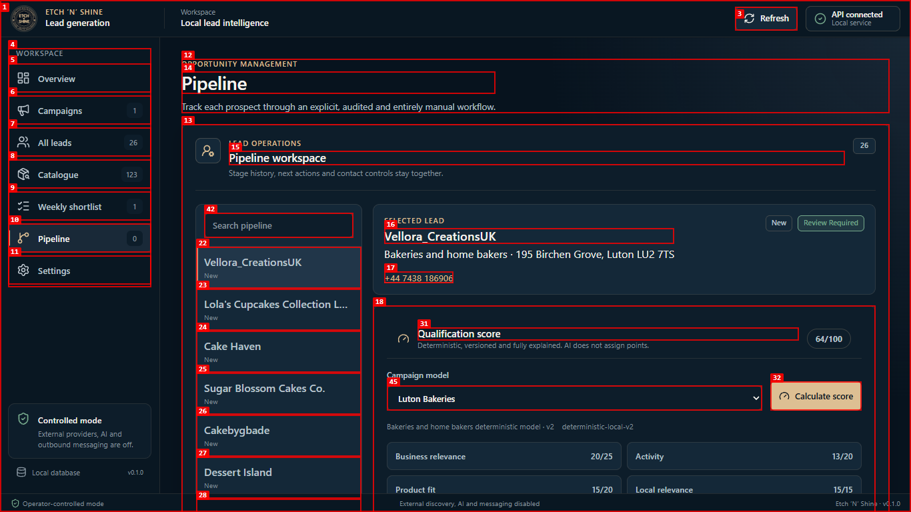

**Resolution verification**

The selected lead now separates Overview, Score & products, Opportunity, Activity & follow-up and Privacy. Privacy actions no longer compete with everyday lead work.

### ISSUE-006: Settings lacks task-level navigation

| Field | Value |
|-------|-------|
| **Severity** | low |
| **Status** | resolved |
| **Category** | ux |
| **URL** | `http://127.0.0.1:1421` → Settings |
| **Repro Video** | N/A — visible on load |

**Description**

Provider credentials, operating defaults, exports, backup verification and diagnostics share one page. The section remains usable, but the separation between integration setup and local data administration is weak. Tabs for **Connections**, **Defaults**, **Data & backup**, and **Diagnostics** would make each task easier to locate and reduce accidental interaction with unrelated controls.

**Evidence**

1. Open Settings and observe all administration areas in one region.
   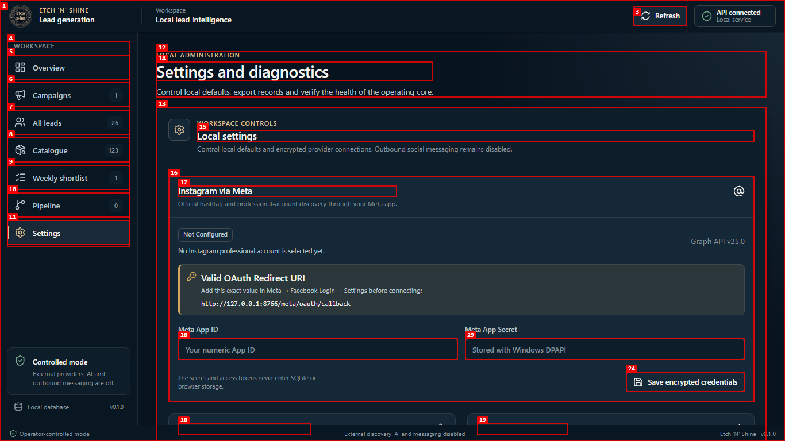

**Resolution verification**

Connections, Defaults, Data & backup and Diagnostics are now independent tasks. The layout was also checked at 1024 × 768.
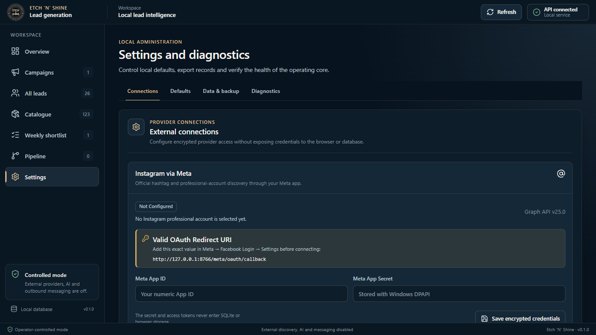
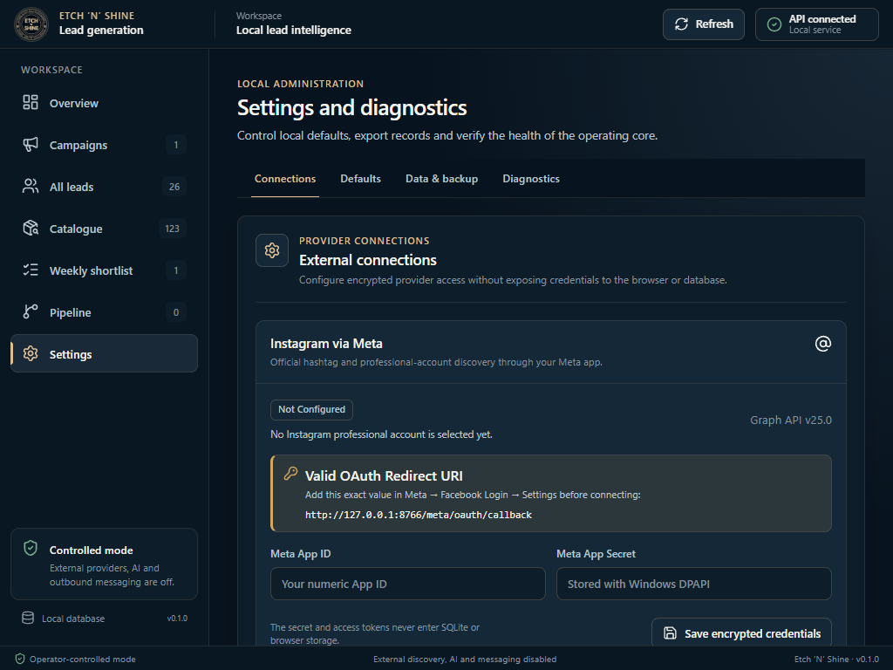
